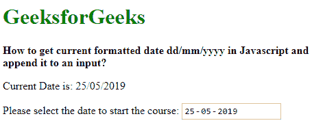

# 如何在 Javascript 中获取当前格式化日期 dd/mm/yyyy 并追加到输入中？

> 原文:[https://www . geesforgeks . org/how-to-current-formated-date-DD-mm-yyyy-in-JavaScript-and-append-it-a-input/](https://www.geeksforgeeks.org/how-to-get-current-formatted-date-dd-mm-yyyy-in-javascript-and-append-it-to-an-input/)

**方法 1:使用 tolocaledatastring()方法:**tolocaledatastring()方法用于将 date 对象的日期部分作为字符串返回语言敏感的表示形式。它有两个可选参数，区域设置和选项。语言环境参数可以用语言标记来指定，这些标记用于根据该语言环境的格式显示日期。区域设置有各种选项，可用于修改所使用的区域设置。

通过将区域设置指定为“en-GB”，将区域设置设置为“英国英语”，可以将日期格式设置为“dd/mm/yyyy”。

可以使用 valueAsDate 属性将日期设置为输入。默认情况下，此属性接受要在日期选择器中显示的日期对象。可以通过为当前日期分配一个新的 date()对象来显示当前日期。

**语法:**

```
new Date().toLocaleDateString('en-GB')
```

**示例:**

```
<!DOCTYPE html>
<html>

<head>
    <title>
        How to get current formatted date dd/mm/yyyy
        in Javascript and append it to an input?
    </title>
</head>

<body>
    <h1 style="color: green">
        GeeksforGeeks
    </h1>

    <b>
        How to get current formatted date dd/mm/yyyy in 
        Javascript and append it to an input?
    </b>

    <p>
        Current Date is: 
        <span class="currDate"></span>
    </p>

    <p>
        Please select the date to start the course:
        <input type="date" id="dateInput">
    </p>

    <script type="text/javascript">
            let currDate =
                new Date().toLocaleDateString('en-GB');

            let inputDate = new Date();

            document.querySelector('.currDate').textContent
                    = currDate;

            document.querySelector('#dateInput').valueAsDate
                    = inputDate;
    </script>
</body>

</html>                    
```

**输出:**


**方法 2:从 tolocaliostring()方法中拼接字符串:**可以从 tolocaliostring()方法返回的字符串中提取日期。使用 slice(0，10)将返回的字符串从 0 分割到第 10 个索引，使用破折号(-)分隔符将字符串分割成单独的部分，反转以首先生成日值，然后使用斜杠(/)作为分隔符将其连接回来。这给出了“日/月/年”格式的日期。

可以使用 valueAsDate 属性将日期设置为输入。默认情况下，此属性接受要在日期选择器中显示的日期对象。可以通过为当前日期分配一个新的 date()对象来显示当前日期。

**语法:**

```
new Date().toISOString().slice(0, 10).split('-').reverse().join('/')
```

**示例:**

```
<!DOCTYPE html>
<html>

<head>
    <title>
        How to get current formatted date dd/mm/yyyy
        in Javascript and append it to an input?
    </title>
</head>

<body>
    <h1 style="color: green">
        GeeksforGeeks
    </h1>

    <b>
        How to get current formatted date dd/mm/yyyy in 
        Javascript and append it to an input?
    </b>

    <p>
        Current Date is: 
        <span class="currDate"></span>
    </p>

    <p>
        Please select the date to start the course:
        <input type="date" id="dateInput">
    </p>

    <script type="text/javascript">
            let currDate = 
                new Date().toISOString().slice(0, 10)
                    .split('-').reverse().join('/');

            let inputDate = new Date();

            document.querySelector('.currDate').textContent
                    = currDate;
            document.querySelector('#dateInput').valueAsDate
                    = inputDate;
    </script>
</body>

</html>                    
```

**输出:**
