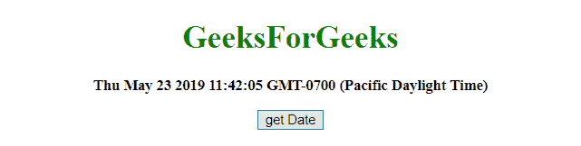
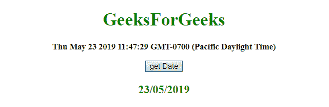

# 如何在 JavaScript 中获取当前格式化日期 dd/mm/yyyy？

> 原文:[https://www . geesforgeks . org/how-to-current-formated-date-DD-mm-yyyy-in-JavaScript/](https://www.geeksforgeeks.org/how-to-get-current-formatted-date-dd-mm-yyyy-in-javascript/)

任务是用 JavaScript 将当前日期格式化为 **dd/mm/yyyy** 格式。我们将讨论几个方法。
首先要知道的几个方法

*   **[JavaScript getDate() Method](https://www.geeksforgeeks.org/javascript-date-getdate-function/):**
    This method returns the day of the month (from 1 to 31) for the defined date.
    **Syntax:**

    ```
    Date.getDate()

    ```

    **返回值:**
    返回一个数字，从 1 到 31，代表一个月中的某一天。

*   **[JavaScript getFullYear() Method](https://www.geeksforgeeks.org/javascript-date-getfullyear-function/):**
    This method returns the year (four digits for dates between year 1000 and 9999) of the defined date.
    **Syntax:**

    ```
    Date.getFullYear()

    ```

    **返回值:**
    返回一个数字，代表定义日期的年份

*   **[JavaScript getMonth()方法](https://www.geeksforgeeks.org/javascript-date-getmonth-method/) :**
    该方法根据到当地时间返回定义日期的月份(从 0 到 11)。
    **语法:**

```
Date.getMonth()

```

**返回值:**
返回一个数字，从 0 到 11，代表月份。

*   **[JavaScript String slice() method](https://www.geeksforgeeks.org/javascript-string-slice/):**
    This method gets parts of a string and returns the extracted parts in a new string.
    It uses the start and end parameters to define the part of the string to extract.
    First character starts from position 0, the second has position 1, and so on.
    **Syntax:**

    ```
    string.slice(start, end)

    ```

    **参数:**

    *   **开始:**此参数为必填项。它指定开始提取的位置。第一个字符位于位置 0
    *   **结束:**此参数为可选。它指定停止提取的位置(不包括它)。如果不使用，slice()将选择从开始位置到字符串结尾的所有字符。

    **返回值:**
    返回一个字符串，代表字符串的提取部分。

    *   **[replace() method](https://www.geeksforgeeks.org/javascript-replace-method/):**
    This method searches a string for a defined value, or a regular expression, and returns a new string with the replaced defined value.
    **Syntax:**

    ```
    string.replace(searchVal, newvalue)

    ```

    **参数:**

    *   **搜索值:**此参数为必填项。它指定将被新值替换的值或正则表达式。
    *   **新值:**此参数为必填项。它指定要替换搜索值的值。

    **返回值:**
    返回一个新字符串，其中定义的值已被新值替换。

**示例 1:** 本示例通过同时检查日期和月份来设置日期的格式，如果日期和月份不在 2 位数内，则加零使其为 2 位数。

```
<!DOCTYPE HTML>
<html>

<head>
    <title>
        JavaScript 
      | How to get current formatted date dd/mm/yyyy.
    </title>
</head>

<body style="text-align:center;"
      id="body">
    <h1 style="color:green;">  
            GeeksForGeeks  
        </h1>
    <p id="GFG_UP" 
       style="font-size: 15px; 
              font-weight: bold;">
    </p>
    <button onclick="gfg_Run()">
        get Date
    </button>
    <p id="GFG_DOWN" 
       style="color:green; 
              font-size: 20px; 
              font-weight: bold;">
    </p>
    <script>
        var el_up = document.getElementById("GFG_UP");
        var el_down = document.getElementById("GFG_DOWN");
        var today = new Date();
        el_up.innerHTML = today;
        var dd = today.getDate();
        var mm = today.getMonth() + 1;

        var yyyy = today.getFullYear();
        if (dd < 10) {
            dd = '0' + dd;
        }
        if (mm < 10) {
            mm = '0' + mm;
        }
        var today = dd + '/' + mm + '/' + yyyy;

        function gfg_Run() {
            el_down.innerHTML = today;
        }
    </script>
</body>

</html>
```

**输出:**

*   **点击按钮前:**
    
*   **点击按钮后:**
    

**示例 2:** 本示例首先从日期对象中分割日期部分，然后以 dd/mm/yyyy 格式设置日期。

```
<!DOCTYPE HTML>
<html>

<head>
    <title>
        JavaScript 
      | How to get current formatted date dd/mm/yyyy.
    </title>
</head>

<body style="text-align:center;"
      id="body">
    <h1 style="color:green;">  
            GeeksForGeeks  
        </h1>
    <p id="GFG_UP" 
       style="font-size: 15px;
              font-weight: bold;">
    </p>
    <button onclick="gfg_Run()">
        get Date
    </button>
    <p id="GFG_DOWN"
       style="color:green; 
              font-size: 20px; 
              font-weight: bold;">
    </p>
    <script>
        var el_up = document.getElementById("GFG_UP");
        var el_down = document.getElementById("GFG_DOWN");
        var today = new Date();
        el_up.innerHTML = today;

        function gfg_Run() {
            var date = today.toJSON().slice(0, 10);
            var nDate = date.slice(8, 10) + '/' 
                       + date.slice(5, 7) + '/' 
                       + date.slice(0, 4);
            el_down.innerHTML = nDate;
        }
    </script>
</body>

</html>
```

**输出:**

*   **点击按钮前:**
    
*   **点击按钮后:**
    

JavaScript 最出名的是网页开发，但它也用于各种非浏览器环境。您可以通过以下 [JavaScript 教程](https://www.geeksforgeeks.org/javascript-tutorial/)和 [JavaScript 示例](https://www.geeksforgeeks.org/javascript-examples/)从头开始学习 JavaScript。