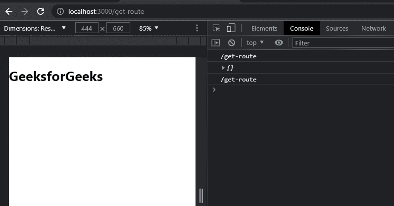
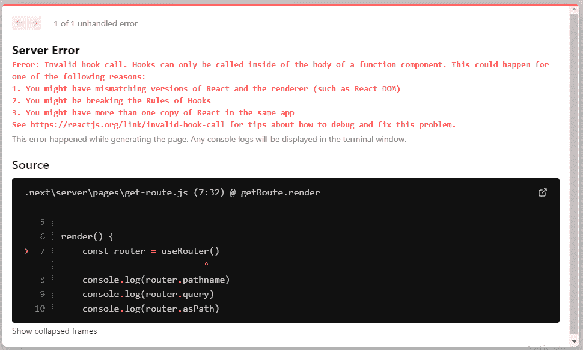
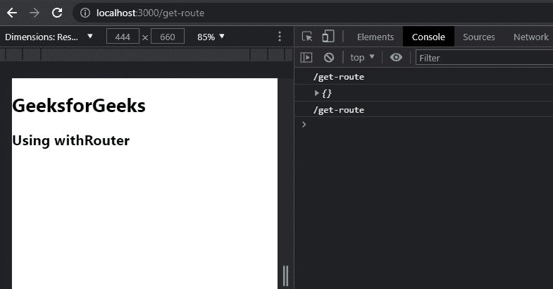
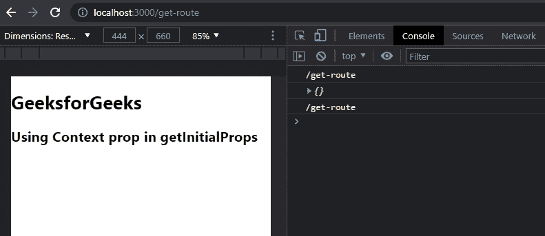

# 如何在 Next.js 中获取当前路线？

> 原文:[https://www . geesforgeks . org/如何获取当前路线下一个 js/](https://www.geeksforgeeks.org/how-to-get-current-route-in-next-js/)

在本文中，我们将学习如何在我们的 NextJS 项目中获取当前路线。

NextJS 是一个基于 React 的框架。它有能力为不同的平台开发漂亮的网络应用程序，如视窗、Linux 和 mac。动态路径的链接有助于有条件地呈现您的 NextJS 组件。

**创建 NextJS 应用程序:**您可以使用以下命令创建一个新的 NextJs 项目:

```
npx create-next-app gfg
```

**项目结构:**会是这样的。


在本文中，我们将研究在 NextJs 中获取当前路线的 3 种方法。

*   使用 useRouter()。
*   使用 withRouter()。
*   在 getInitialProps 中使用上下文道具。

让我们通过实现来理解这三种方法。

**方法 1:使用 useRouter()方法:**在 NextJs 中，我们可以使用 useRouter()函数轻松获取当前路由的值。为此，我们将在 pages 目录中创建一个名为“ **get-route.js** 的新页面。之后，我们将在 get-route.js 页面中添加下面的代码。在下面的代码中，我们首先从 next/Router 导入我们的 useRouter 函数，然后创建一个名为 getRoute 的新函数，在这个函数中，我们调用我们的 useRouter()，并将这个变量存储在一个名为 router 的新常量变量中。之后，我们显示路径名、路径名和来自路由变量的查询。

## java 描述语言

```
import React from 'react'
import {useRouter} from 'next/router';

export default function getRoute() {
    // Calling useRouter() hook
    const router = useRouter()
    return (
        <div>
            <h1>GeeksforGeeks</h1>
            <h2>pathname:- {router.pathname}</h2>
            <h2>query:- {router.query}</h2>
            <h2>asPath:- {router.asPath}</h2>
        </div>
    )
}
```

**运行应用程序的步骤:**在终端中键入以下命令，启动开发服务器。

```
npm run dev
```

### 输出:



在上面的例子中，首先，我们调用我们的 useRouter()钩子，然后，我们在控制台中显示路由器的对象。

*   **路径名:**当前路线。这是“/pages”中页面的路径。
*   **查询:**解析为对象的查询字符串。
*   **asPath:** 浏览器中显示的路径(包括查询)。

但是 useRouter()是一个 react hook，所以如果您在类组件中使用它，这将给出一个错误。因此，如果我们将 getRoute()函数更改为具有相同内容的类，那么我们将获得以下输出。

在下面的代码中，我们只是将函数更改为类组件。

## java 描述语言

```
import React from 'react'
import {useRouter} from 'next/router';

export class getRoute extends React.Component {

    render() {
        // Calling useRouter() hook
        const router = useRouter()
        console.log(router.pathname)
        console.log(router.query)
        console.log(router.asPath)
        return (
            <div>
                <h1>GeeksforGeeks</h1>
            </div>
        )
    }
}

export default getRoute
```

**运行应用程序的步骤:**在终端中键入以下命令，启动开发服务器。

```
npm run dev
```

#### 输出:



为了解决这个问题，我们可以使用路由器()。

**方法 2:使用 withRouter()方法:**您可以使用 withRouter()轻松获取 react 类组件中的当前路由器值。要使用它，您只需要在 withRouter()中导出您的类组件。在下面的代码中，我们首先从下一个/router 中导入我们的 withRouter 函数，然后创建一个名为 getRoute 的新类组件，在这个组件中，在我们的渲染函数中，我们显示路径名、路径名和从我们的类中接收到的道具的查询。之后，我们将导出我们的类 u=inside withRouter()函数。

## java 描述语言

```
import React from 'react'
import {withRouter} from 'next/router';

export class getRoute extends React.Component {

    render() {
        console.log(this.props.router.pathname)
        console.log(this.props.router.query)
        console.log(this.props.router.asPath)
        return (
            <div>
                <h1>GeeksforGeeks</h1>
                <h2>Using withRouter</h2>
            </div>
        )
    }
}

export default withRouter(getRoute)
```

**运行应用程序的步骤:**在终端中键入以下命令，启动开发服务器。

```
npm run dev
```

#### 输出:



**方法 3:使用 getInitialProps()方法:**您还可以访问 getInitialProps()内部的路由上下文属性的值。上下文道具包含路由信息，如路径、查询和路径名。在下面的代码中，我们首先从下一个/router 中导入我们的 withRouter 函数，然后创建一个名为 getRoute 的新类组件，在这个组件中，我们创建了一个包含上下文作为道具的异步 getIntitalProps 函数。然后我们将上下文的值存储在一个新的变量中并返回它们。然后，在我们的渲染函数中，我们显示路径名、路径和来自我们类中接收的道具的查询。

## java 描述语言

```
import React from 'react'
import {withRouter} from 'next/router';

export class getRoute extends React.Component {

    static async getInitialProps(context) {
        // Using context prop to get asPath, query, context
        const {asPath, query, pathname} = context 
        return{asPath, query, pathname}
    }

    render() {
        // Consoling the values
        console.log(this.props.pathname)
        console.log(this.props.query)
        console.log(this.props.asPath)
        return (
            <div>
                <h1>GeeksforGeeks</h1>
                <h2>Using Context prop in getInitialProps</h2>
            </div>
        )
    }
}

export default getRoute
```

**运行应用程序的步骤:**在终端中键入以下命令，启动开发服务器。

```
npm run dev
```

#### 输出:

