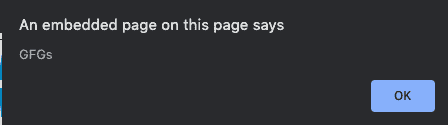
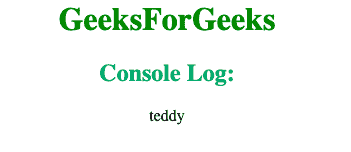

# 如何用 JavaScript 获取当前运行的函数名？

> 原文:[https://www . geesforgeks . org/how-to-current-running-function-name-use-JavaScript/](https://www.geeksforgeeks.org/how-to-get-currently-running-function-name-using-javascript/)

给定一个函数，任务是获取当前使用 JavaScript 运行的函数的名称。

*   **Approach 1: Using arguments.callee method:** It refers to the currently executing function inside the function body of that function. In this method, we use *arguments.callee* to refer to the name of the function. So we define a new variable as *arguments.callee.toString()*. Then we use (variable_name).substr to get the function and then we display it as an alert.

    **语法:**

    ```
    arguments.callee.toString()
    ```

    你可能需要解析这个名字，因为它可能会包含一些额外的垃圾。

    **示例 1:** 本示例使用**参数.被调用方**方法显示当前运行的函数。

    ```
    <!DOCTYPE HTML>
    <html> 

    <head> 
        <title> 
            How to get currently running
            function name using JavaScript ?
        </title> 
    </head> 

    <body style = "text-align:center;"> 

        <h1 style = "color:green;" > 
            GeeksForGeeks 
        </h1> 

        <script> 
            function GFGs() {
                var me = arguments.callee.toString();
                me = me.substr('function '.length);     
                me = me.substr(0, me.indexOf('('));     
                alert(me);
            }
            GFGs();         
        </script> 
    </body> 

    </html>
    ```

    **输出:**
    

*   **Approach 2:** With the help of *console.log method*, we define a new function which returns the name of the function and call it the present function.

    **语法:**

    ```
    function getFuncName() {
        return getFuncName.caller.name
    }
    function teddy() { 
        console.log(getFuncName())
    }
    teddy()
    ```

    **示例 2:** 本示例使用 **console.log** 方法显示当前运行的功能。

    ```
    <!DOCTYPE html>
    <html> 

    <head>
        <title> 
            How to get currently running
            function name using JavaScript ?
        </title> 
    </head> 

    <body style = "text-align:center;"> 

        <h1 style = "color:green;" > 
            GeeksForGeeks 
        </h1> 

        <script> 
            function getFuncName() {
                return getFuncName.caller.name
            }

            function teddy() { 
                console.log(getFuncName())
            }
            teddy()     
        </script> 
    </body> 

    </html>
    ```

    **输出:**
    