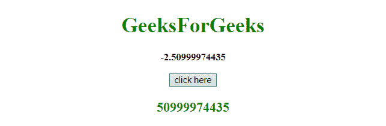
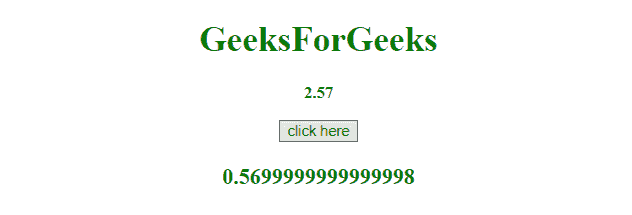

# 如何用 JavaScript 获取数字的小数部分？

> 原文:[https://www . geesforgeks . org/如何使用 javascript 获取数字的小数部分/](https://www.geeksforgeeks.org/how-to-get-decimal-portion-of-a-number-using-javascript/)

给定一个浮点数，任务是使用 JavaScript 将数字分成整数和小数部分。例如，值 15.6 将被分成两个数字，即 15 和 0.6。下面讨论几个方法。

*   **方法 1:** 采用**分裂()**法。
    这个方法用于将一个字符串拆分为一个子字符串数组，并返回新的数组。
    **语法:**

```
string.split(separator, limit)
```

**参数:**

*   **分隔符:**此参数为可选。它指定用于拆分字符串的字符或正则表达式。如果不使用，将返回整个字符串(只有一项的数组)
*   **极限:**此参数为可选。它指定指定拆分次数的整数，超出拆分限制的项目将从数组中排除。

**返回值:**
返回一个新数组，包含拆分后的项目。

**示例 1:** 本示例首先将数字转换为字符串，然后使用 **split()方法**删除小数点前的部分。

## 超文本标记语言

```
<!DOCTYPE HTML>
<html>

<head>
    <title>
        JavaScript
      | Get decimal portion of a number.
    </title>
</head>

<body style="text-align:center;" id="body">
    <h1 style="color:green;"> 
            GeeksForGeeks 
        </h1>
    <p id="GFG_UP"
       style="font-size: 15px;            
              font-weight: bold;">
    </p>

    <button onclick="GFG_Fun()">
        click here
    </button>
    <p id="GFG_DOWN"
       style="color:green;
              font-size: 20px;
              font-weight: bold;">
    </p>

    <script>
        var up = document.getElementById('GFG_UP');
        var n = -2.50999974435;
        up.innerHTML = n;
        var down = document.getElementById('GFG_DOWN');

        function GFG_Fun() {
            down.innerHTML = (n + "").split(".")[1];
        }
    </script>
</body>

</html>
```

**输出:**

*   **点击按钮前:**


*   **点击按钮后:**



**方法二:**使用**数学腹肌()**和**数学地板()**。

*   [**【Math.abs()】**](https://www.geeksforgeeks.org/javascript-math-abs-function/)**:**JavaScript 中的 math . ABS()函数用于返回一个数字的绝对值。它以一个数字为参数，并返回其绝对值。
*   [**【数学地板( )】**](https://www.geeksforgeeks.org/javascript-math-floor-function/)**:**JavaScript 中的数学地板()函数用于将作为参数传递的数字舍入到其在**向下方向**上的最接近的整数，即舍入到较小的值。

**例 2:** 本例用原数减去数的底，得到小数部分。但在这种情况下，我们会得到小数点后的精确部分。我们会得到大致的结果。

## 超文本标记语言

```
<!DOCTYPE HTML>
<html>

<head>
    <title>
        JavaScript
      | Get decimal portion of a number.
    </title>
</head>

<body style="text-align:center;" id="body">
    <h1 style="color:green;"> 
            GeeksForGeeks 
        </h1>
    <p id="GFG_UP"
       style="font-size: 15px;
              font-weight: bold;">
    </p>

    <button onclick="GFG_Fun()">
        click here
    </button>
    <p id="GFG_DOWN"
       style="color:green;
              font-size: 20px;
              font-weight: bold;">
    </p>

    <script>
        var up = document.getElementById('GFG_UP');
        var n = 2.57;
        up.innerHTML = n;
        var down = document.getElementById('GFG_DOWN');

        function GFG_Fun() {
            n = Math.abs(n)
            down.innerHTML = n - Math.floor(n);
        }
    </script>
</body>

</html>
```

**输出:**

*   **点击按钮前:**


*   **点击按钮后:**

