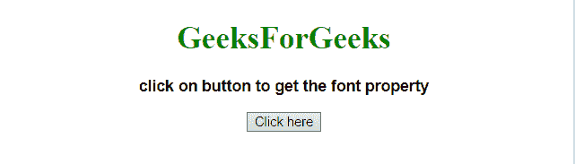
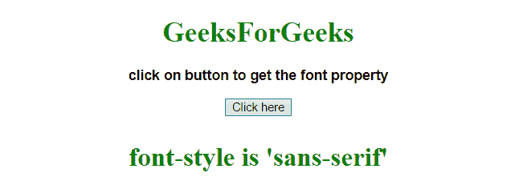
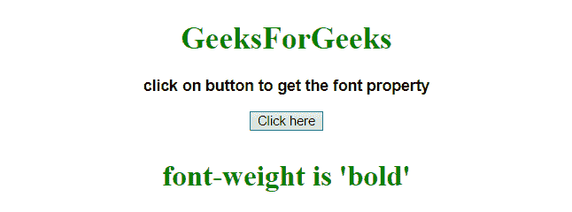

# 如何在 JavaScript 中获取特定元素的字体属性？

> 原文:[https://www . geesforgeks . org/如何获取 javascript 中特定元素的字体属性/](https://www.geeksforgeeks.org/how-to-get-font-properties-of-particular-element-in-javascript/)

给定一个字符串元素，任务是使用 JavaScript 获取特定元素的字体属性。

**进场:**

*   将字符串存储到变量中。
*   然后使用 element.style.property 获取该元素属性的 propertyValue。

**示例 1:** 本示例获取元素[id = 'GFG_UP']的字体系列。

```
<!DOCTYPE HTML> 
<html> 
    <head> 
        <title> 
            How to get the font family property of
            a particular element in JavaScript ?
        </title>
    </head> 

    <body style = "text-align:center;"> 

        <h1 style = "color:green;" > 
            GeeksForGeeks 
        </h1> 

        <p id = "GFG_UP" style =
            "font-size: 16px; font-family: sans-serif; font-weight: bold;">     
        </p>

        <button onclick = "gfg_Run()"> 
            Click here
        </button>

        <p id = "GFG_DOWN" style = 
            "color:green; font-size: 30px; font-weight: bold;">
        </p>

        <script>
            var el_up = document.getElementById("GFG_UP");
            var el_down = document.getElementById("GFG_DOWN");

            var str = "click on button to get the font property";

            el_up.innerHTML = str;

            function gfg_Run() {
                el_down.innerHTML =
                    "font-style is '" + el_up.style.fontFamily + "'";
            }         
        </script> 
    </body> 
</html>
```

**输出:**

*   **点击按钮前:**
    
*   **点击按钮后:**
    

**示例 2:** 本示例获取元素[id = 'GFG_UP']的字体粗细。

```
<!DOCTYPE HTML>  
<html>  
    <head> 
        <title> 
            How to get the font weight property of
            a particular element in JavaScript ?
        </title>
    </head> 

    <body style = "text-align:center;">

        <h1 style = "color:green;" >  
            GeeksForGeeks  
        </h1> 

        <p id = "GFG_UP" style = 
            "font-size: 16px; font-family: sans-serif; font-weight: bold;">     
        </p>

        <button onclick = "gfg_Run()"> 
            Click here
        </button>

        <p id = "GFG_DOWN" style =
            "color:green; font-size: 30px; font-weight: bold;">
        </p>

        <script>
            var el_up = document.getElementById("GFG_UP");
            var el_down = document.getElementById("GFG_DOWN");

            var str = "click on button to get the font property";

            el_up.innerHTML = str;

            function gfg_Run() {
                el_down.innerHTML = 
                    "font-weight is '"+el_up.style.fontWeight + "'";
            }           
        </script> 
    </body>  
</html>
```

**输出:**

*   **点击按钮前:**
    
*   **点击按钮后:**
    