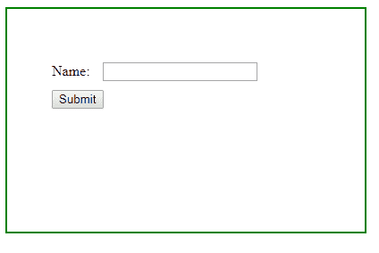
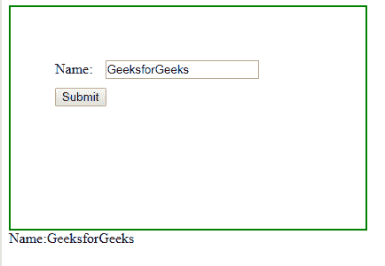

# 如何使用 JavaScript/jQuery 获取表单数据？

> 原文:[https://www . geesforgeks . org/how-to-form-data-use-JavaScript-jquery/](https://www.geeksforgeeks.org/how-to-get-form-data-using-javascript-jquery/)

[serializeArray()方法](https://www.geeksforgeeks.org/jquery-serializearray-with-examples/)通过序列化表单值来创建对象(名称和值)的数组。这个方法可以用来获取表单数据。

**语法:**

```
$(selector).serializeArray()
```

**参数:**不接受任何参数。

**返回值:**返回输入字段中的所有值。

**示例:**

```
<!DOCTYPE html>
<html>

<head>
    <script src=
"https://ajax.googleapis.com/ajax/libs/jquery/3.4.0/jquery.min.js">
    </script>

    <script>
        $(document).ready(function() {
            $("button").click(function() {
                var x = $("form").serializeArray();
                $.each(x, function(i, field) {
                    $("#output").append(field.name + ":"
                            + field.value + " ");
                });
            });
        });
    </script>

    <style>
        #GFG {
            width: 300px;
            padding: 50px;
            height: 150px;
            border: 2px solid green;
        }
    </style>
</head>

<body>
    <div id="GFG">
        <form action="#">
            Name: <input type="text" 
                style="margin: 10px;" name="Name">
            <br>
        </form>

        <button>Submit</button>
    </div>

    <div id="output"></div>
</body>

</html>
```

**输出:**

*   **点击按钮前:**
    
*   **点击按钮后:**
    

jQuery 是一个开源的 JavaScript 库，它简化了 HTML/CSS 文档之间的交互，它以其“少写多做”的理念而闻名。
跟随本 [jQuery 教程](https://www.geeksforgeeks.org/jquery-tutorials/)和 [jQuery 示例](https://www.geeksforgeeks.org/jquery-examples/)可以从头开始学习 jQuery。