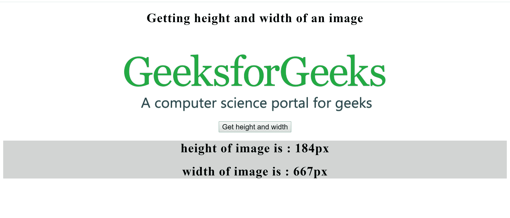

# 如何用 JavaScript 获取图像大小(高度&宽度)？

> 原文:[https://www . geesforgeks . org/如何使用 javascript 获取图像大小高度宽度/](https://www.geeksforgeeks.org/how-to-get-image-size-height-width-using-javascript/)

为了获得图像的大小(高度和宽度)，使用**元素.客户端高度**和**元素.客户端宽度**属性。

*   **Element.clientHeight:** 我们可以用这个属性访问元素的内部高度。这个高度包括填充，但不包括边距和边框。
*   **Element.clientWidth:** We can access the inner width of an element with this property. This width include the padding but not the margin and border.

    **注意:**这里的元素是图像，所以**图像、客户端高度**和**图像、客户端宽度**将分别用于获取图像的高度和宽度。

    **示例:**获取图像大小。

    ```
    <!DOCTYPE html>
    <html lang="en">

    <head>
        <meta charset="UTF-8">
        <title>
          getting-height-width-image-using-javascript
      </title>
        <style>
            h1 {
                text-align: center;
                letter-spacing: 1px;
            }

            img,
            button {
                display: block;
                margin: 0 auto;
            }

            button {
                font-size: large;
            }
        </style>
    </head>

    <body>

        <h1>
          Getting height and width of an image
      </h1>
        <br>
        <br>
        
        <button type="submit"
                onclick="myFunc()">
          Get height and width
      </button>

        <div style="background-color: lightgray">
            <div id="height">

            </div>

            <div id="width">

            </div>
        </div>
    </body>

    <script>
        function myFunc() {
            let image = document.getElementById('image');
            let height = document.getElementById('height');
            var width = document.getElementById('width');

            height.innerHTML += '<h1>height of image is :'
            + image.clientHeight + 'px </h1>';

            width.innerHTML += '<h1>width of image is :'
            + image.clientWidth + 'px </h1>';
        }
    </script>

    </html>
    ```

    **输出:**
    **点击按钮后:**
    

    **点击按钮后:**
    