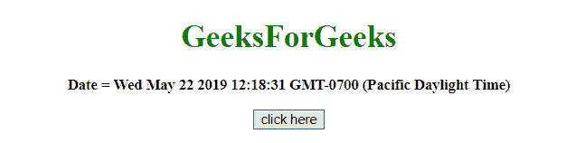

# 如何获取两位数格式的 JavaScript 的月份和日期？

> 原文:[https://www . geesforgeks . org/如何获取两位数格式的 javascript 月和日期/](https://www.geeksforgeeks.org/how-to-get-month-and-date-of-javascript-in-two-digit-format/)

给定一个日期，任务是获取 2 位格式的**月份**和**日期**。使用 JavaScript 方法获取两位数格式的月份和日期。

*   **JavaScript getDate() Method:** This method returns the day of the month (from 1 to 31) for the defined date.

    **语法:**

    ```
    Date.getDate()
    ```

    **返回值:**返回一个数字，从 1 到 31，代表一个月中的某一天。

*   **JavaScript getMonth()方法:**此方法根据到当地时间返回定义日期的月份(从 0 到 11)。

**语法:**

```
Date.getMonth()
```

**返回值:**返回一个数字，从 0 到 11，代表月份。

*   **JavaScript String slice() method:** This method gets part of a string and returns the extracted parts in a new string. It uses the start and end parameters to define the part of the string to extract. First character starts from position 0, the second has position 1, and so on.

    **语法:**

    ```
    string.slice(start, end)
    ```

    **参数:**

    *   **开始:**此参数为必填项。它指定开始提取的位置。第一个字符位于位置 0
    *   **结束:**此参数为可选。它指定停止提取的位置(不包括它)。如果不使用，slice()将选择从开始位置到字符串结尾的所有字符。

    **返回值:**返回一个字符串，代表字符串的提取部分。

**例 1:** 本例首先获取**日期**和**月份**，然后使用 **getDate()、getMonth()和 slice()方法**进行适当切片，得到两位数格式。

```
<!DOCTYPE HTML> 
<html> 
    <head> 
        <title> 
            How to get the Month and Date of 
            JavaScript in 2 digit format
        </title>
    </head> 

    <body style = "text-align:center;">

        <h1 style = "color:green;" > 
            GeeksForGeeks 
        </h1>

        <p id = "GFG_UP" style = "font-size: 15px; font-weight: bold;">
        </p>

        <button onclick = "gfg_Run()"> 
            click here
        </button>

        <p id = "GFG_DOWN" style = 
            "color:green; font-size: 20px; font-weight: bold;">
        </p>

        <script>
            var el_up = document.getElementById("GFG_UP");
            var el_down = document.getElementById("GFG_DOWN");
            var today = new Date();
            el_up.innerHTML = "Date = " + today;

            function gfg_Run() {
                var a = new Date();
                var month = ("0" + (a.getMonth() + 1)).slice(-2);
                var date = ("0" + a.getDate()).slice(-2);
                el_down.innerHTML = "Date = " + date + ", Month = " + month;
            }         
        </script> 
    </body> 
</html>                    
```

**输出:**

*   **点击按钮前:**
    
*   **点击按钮后:**
    

**示例 2:** 该示例创建了一个函数，该函数在小于 10 的情况下将零添加到**日期**中，并使用 **getDate()和 getMonth()方法**为**月份**适当地添加零。

```
<!DOCTYPE HTML> 
<html> 
    <head> 
        <title> 
            How to get the Month and Date of
            JavaScript in 2 digit format
        </title>
    </head> 

    <body style = "text-align:center;">

        <h1 style = "color:green;" > 
            GeeksForGeeks 
        </h1>

        <p id = "GFG_UP" style = "font-size: 15px; font-weight: bold;">
        </p>

        <button onclick = "gfg_Run()"> 
            click here
        </button>

        <p id = "GFG_DOWN" style = 
            "color:green; font-size: 20px; font-weight: bold;">
        </p>

        <script>
            var el_up = document.getElementById("GFG_UP");
            var el_down = document.getElementById("GFG_DOWN");
            var today = new Date();
            el_up.innerHTML = "Date = " + today;

            function formatDateToString(date) {
                var dd = (date.getDate() < 10 ? '0' : '')
                        + date.getDate();

                var MM = ((date.getMonth() + 1) < 10 ? '0' : '')
                        + (date.getMonth() + 1);

                return "Date = " + dd + ", Month = " + MM;
            }

            function gfg_Run() {
                var a = new Date();
                el_down.innerHTML = formatDateToString(a);
            }         
        </script> 
    </body> 
</html>                    
```

**输出:**

*   **点击按钮前:**
    
*   **点击按钮后:**
    