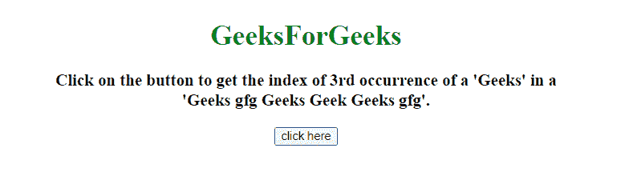
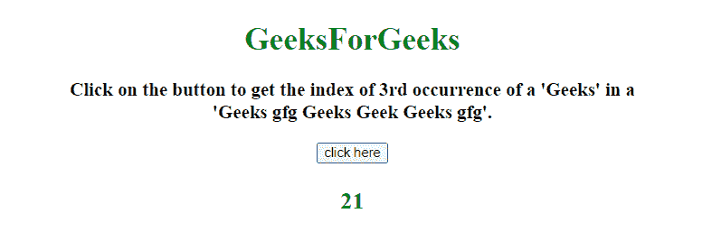
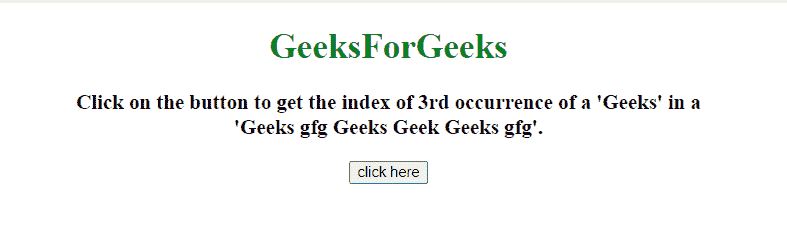
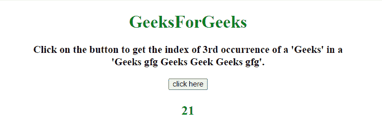

# 如何在 JavaScript 中获取字符串的第 n 次出现？

> 原文:[https://www . geeksforgeeks . org/如何获取第 n 次出现的 javascript 字符串/](https://www.geeksforgeeks.org/how-to-get-nth-occurrence-of-a-string-in-javascript/)

任务是在 JavaScript 的帮助下获取字符串中第 n 次出现的子字符串。

**方法 1:**

*   首先，通过传递索引，使用 **split()方法**将字符串拆分为子字符串。
*   再次使用 **join()方法**在传递的子串上连接子串。
*   返回字符串第 n 次出现的索引。

**示例:**在本例中，使用 **split()和 join()方法**获取子串的索引。

```
<!DOCTYPE HTML> 
<html> 

<head> 
    <title> 
        How to get nth occurrence of
        a string in JavaScript ?
    </title>
</head> 

<body style = "text-align:center;"> 

    <h1 style = "color:green;" > 
        GeeksForGeeks
    </h1>

    <p id = "GFG_UP" style = 
        "font-size: 19px; font-weight: bold;">
    </p>

    <button onclick = "GFG_Fun()">
        click here
    </button>

    <p id = "GFG_DOWN" style = 
        "color: green; font-size: 24px; font-weight: bold;">
    </p>

    <script>
        var el_up = document.getElementById("GFG_UP");
        var el_down = document.getElementById("GFG_DOWN");
        var string = "Geeks gfg Geeks Geek Geeks gfg";
        var searchString = 'Geeks';
        var occurrence = 3;

        el_up.innerHTML = "Click on the button to get the index of "
                + occurrence + "rd occurrence of a '" + searchString
                + "' in a <br>'" + string + "'.";

        function getPos(str, subStr, i) {
            return str.split(subStr, i).join(subStr).length;
        }
        function GFG_Fun() {
            el_down.innerHTML
                    = getPos(string, searchString, occurrence);
        }
    </script> 
</body>

</html>
```

**输出:**

*   **点击按钮前:**
    
*   **点击按钮后:**
    

**方法 2:** 逐个遍历每个子串，返回最后一个子串的索引。这种方法使用 indexOf()方法返回字符串第 n 个<sup>出现的索引。</sup>

**示例:**

```
<!DOCTYPE HTML> 
<html> 

<head> 
    <title> 
        How to get nth occurrence of
        a string in JavaScript ?
    </title>
</head> 

<body style = "text-align:center;" id = "body"> 

    <h1 style = "color:green;" > 
        GeeksForGeeks
    </h1>

    <p id = "GFG_UP" style = 
        "font-size: 19px; font-weight: bold;">
    </p>

    <button onclick = "GFG_Fun()">
        click here
    </button>

    <p id = "GFG_DOWN" style =
        "color: green; font-size: 24px; font-weight: bold;">
    </p>

    <script>
        var el_up = document.getElementById("GFG_UP");
        var el_down = document.getElementById("GFG_DOWN");
        var string = "Geeks gfg Geeks Geek Geeks gfg";
        var searchString = 'Geeks';
        var occurrence = 3;

        el_up.innerHTML = "Click on the button to get the index of "
                + occurrence + "rd occurrence of a '" + searchString
                + "' in a <br>'" + string + "'.";

        function getIndex(str, substr, ind) {
            var Len = str.length, i = -1;
            while(ind-- && i++ < Len) {
                i = str.indexOf(substr, i);
                if (i < 0) break;
            }
            return i;
        }
        function GFG_Fun() {
            el_down.innerHTML 
                    = getIndex(string, searchString, occurrence);
        }
    </script> 
</body>

</html>
```

**输出:**

*   **点击按钮前:**
    
*   **点击按钮后:**
    