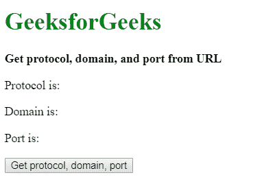
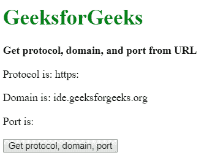

# 如何用 JavaScript 从 URL 获取协议、域、端口？

> 原文:[https://www . geesforgeks . org/如何使用 javascript 从 url 获取协议域和端口/](https://www.geeksforgeeks.org/how-to-get-protocol-domain-and-port-from-url-using-javascript/)

可以通过两种方法找到当前页面的协议、域和端口:

**方法 1:使用 location.protocol、location.hostname、location.port 方法:**location 接口有多种方法可以用来返回需要的属性。

*   location.protocol 属性用于返回 URL 的协议方案以及最后一个冒号(:)。
*   location.hostname 用于返回 URL 的域名。
*   location.port 属性用于返回 URL 的端口。如果 URL 中没有明确描述端口，它将不返回任何内容。

**语法:**

```
protocol = location.protocol;
domain = location.hostname;
port = location.port;
```

**示例:**

```
<!DOCTYPE html>
<html>

<head>
    <title>
        Get protocol, domain, and port from URL
    </title>
</head>

<body>
    <h1 style="color: green">
        GeeksforGeeks
    </h1>

    <b>
        Get protocol, domain, and port from URL
    </b>

    <p>
        Protocol is: 
        <span class="protocol"></span>
    </p>

    <p>
        Domain is: 
        <span class="domain"></span>
    </p>

    <p>
        Port is: 
        <span class="port"></span>
    </p>

    <button onclick="getDetails()">
        Get protocol, domain, port
    </button>

    <script type="text/javascript">
        function getDetails() {
            protocol = location.protocol;
            domain = location.hostname;
            port = location.port;

            document.querySelector('.protocol').textContent
                    = protocol;
            document.querySelector('.domain').textContent
                    = domain;
            document.querySelector('.port').textContent
                    = port;
        }
    </script>
</body>

</html>                    
```

**输出:**

*   **点击按钮前:**
    
*   **点击按钮后:**
    

**方法二:使用 URL 接口:**URL 接口用于表示对象 URL。它可以用于获取端口、域和协议，因为它有获取这些值的内置方法。

*   url.protocol 属性用于返回 url 的协议方案以及最后一个冒号(:)。
*   url.hostname 用于返回 url 的域。
*   url.port 属性用于返回 url 的端口。它返回“如果没有明确描述端口。

**注意:**Internet Explorer 11 不支持该 API。

**语法:**

```
current_url = window.location.href;
url_object = new URL(current_url);

protocol = url_object.protocol;
domain = url_object.hostname;
port = url_object.port;
```

**示例:**

```
<!DOCTYPE html>
<html>

<head>
    <title>
        Get protocol, domain, and port from URL
    </title>
</head>

<body>
    <h1 style="color: green">
        GeeksforGeeks
    </h1>

    <b>
        Get protocol, domain, and port from URL
    </b>

    <p>Protocol is: <span class="protocol"></span></p>
    <p>Domain is: <span class="domain"></span></p>
    <p>Port is: <span class="port"></span></p>

    <button onclick="getDetails()">
        Get protocol, domain, port
    </button>

    <script type="text/javascript">
        function getDetails() {
            current_url = window.location.href;
            url_object = new URL(current_url);

            protocol = url_object.protocol;
            domain = url_object.hostname;
            port = url_object.port;

            document.querySelector('.protocol').textContent
                    = protocol;
            document.querySelector('.domain').textContent
                    = domain;
            document.querySelector('.port').textContent
                    = port;
        }
    </script>
</body>

</html>                    
```

**输出:**

*   **点击按钮前:**
    
*   **点击按钮后:**
    