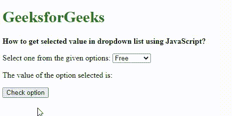
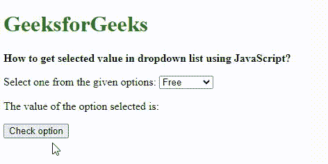

# 如何用 JavaScript 在下拉列表中获取选中值？

> 原文:[https://www . geesforgeks . org/如何使用 javascript 获取下拉列表中的选定值/](https://www.geeksforgeeks.org/how-to-get-selected-value-in-dropdown-list-using-javascript/)

在本文中，我们将学习用 Javascript 在下拉列表中获取选定的值。我们可以使用两种方法获得这些值:

*   通过使用 value 属性
*   通过将 selectedIndex 属性与选项属性一起使用

我们将通过例子来理解这两种方法。

**方法一:使用** [**值属性**](https://www.geeksforgeeks.org/html-dom-value-property/) **:**

通过使用定义列表的选定元素的 value 属性，可以找到选定元素的值。该属性返回一个字符串，代表列表中<option>元素的值属性。如果未选择任何选项，则不会返回任何内容。</option>

**语法:**

```
selectElement.value
```

**示例:**本示例描述了可以为所选元素找到的值属性。

## 超文本标记语言

```
<!DOCTYPE html>

<head>
    <title>
        How to get selected value in
        dropdown list using JavaScript?
    </title>
</head>

<body>
    <h1 style="color: green">
        GeeksforGeeks
    </h1>
    <b>
        How to get selected value in dropdown
        list using JavaScript?
    </b>

<p> Select one from the given options:
        <select id="select1">
            <option value="free">Free</option>
            <option value="basic">Basic</option>
            <option value="premium">Premium</option>
        </select>
    </p>

<p> The value of the option selected is:
        <span class="output"></span>
    </p>

    <button onclick="getOption()"> Check option </button>

    <script type="text/javascript">
    function getOption() {
        selectElement = document.querySelector('#select1');
        output = selectElement.value;
        document.querySelector('.output').textContent = output;
    }
    </script>
</body>

</html>
```

**输出:**



价值属性

**方法 2:使用** [**选择一个属性**](https://www.geeksforgeeks.org/html-dom-select-selectedindex-property/) **与** [**选项属性**](https://www.geeksforgeeks.org/html-dom-option-value-property/) **:**

selectedIndex 属性返回下拉列表中当前选定元素的索引。该索引从 0 开始，如果未选择任何选项，则返回-1。options 属性返回<select>下拉列表中所有选项元素的集合。元素根据页面的源代码进行排序。在可以与此属性一起使用以获取所选元素之前找到的索引。使用 value 属性可以找到该选项的值。</select>

**语法:**

```
selectElement.options[selectElement.selectedIndex].value
```

**属性值:**

*   **选择索引**:用于设置或获取集合中所选<选项>元素的索引。
*   **长度**:只读属性，用于获取集合中<选项>元素的个数。

**返回值:**通过指定<选择>元素中的所有<选项>元素，返回 HTMLOptionsCollection 对象。该元素将在集合中排序

**示例:**本示例使用选项属性描述 selectedIndex 属性。

## 超文本标记语言

```
<!DOCTYPE html>

<head>
    <title>
        How to get selected value in
        dropdown list using JavaScript?
    </title>
</head>

<body>
    <h1 style="color: green">
        GeeksforGeeks
    </h1>
    <b>
        How to get selected value in
        dropdown list using JavaScript?
    </b>

<p> Select one from the given options:
        <select id="select1">
            <option value="free">Free</option>
            <option value="basic">Basic</option>
            <option value="premium">Premium</option>
        </select>
    </p>

<p> The value of the option selected is:
        <span class="output"></span>
    </p>

    <button onclick="getOption()">Check option</button>
    <script type="text/javascript">

    function getOption() {
        selectElement = document.querySelector('#select1');
        output = selectElement.options[selectElement.selectedIndex].value;
        document.querySelector('.output').textContent = output;
    }
    </script>
</body>

</html>
```

**输出:**



使用选项属性选择索引属性

JavaScript 最出名的是网页开发，但它也用于各种非浏览器环境。您可以通过以下 [JavaScript 教程](https://www.geeksforgeeks.org/javascript-tutorial/)和 [JavaScript 示例](https://www.geeksforgeeks.org/javascript-examples/)从头开始学习 JavaScript。