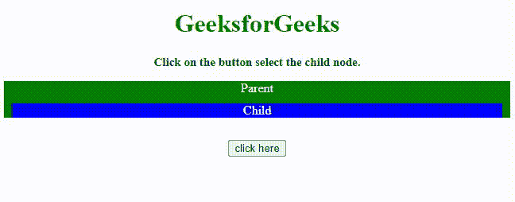
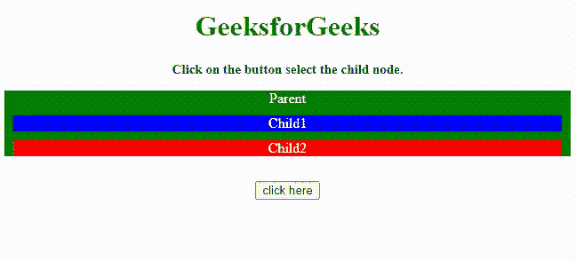

# 如何用 JavaScript 获取父元素的子元素？

> 原文:[https://www . geesforgeks . org/如何使用 javascript 获取父元素的子元素/](https://www.geeksforgeeks.org/how-to-get-the-child-element-of-a-parent-using-javascript/)

在本文中，我们将学习使用 Javascript 获取父元素的子元素。给定一个 HTML 文档，任务是选择一个特定的元素，并在 JavaScript 的帮助下获取父元素的所有子元素。为此，有两种方法可以获取子元素:

*   通过使用[子属性](https://www.geeksforgeeks.org/html-dom-children-property/)
*   使用[查询选择器方法](https://www.geeksforgeeks.org/html-dom-queryselector-method/)

我们将讨论这两种方法，并通过示例了解它们的实现。

**DOM 子元素**属性用于返回指定元素的所有子元素的 HTMLcollection。

**方法 1:**

*   选择要选择其子元素的元素。
*   使用*。子属性*获取元素的所有子元素的访问权限。
*   根据索引选择特定的子级。

**示例 1:** 此示例实现了。**子属性**获取指定元素的所有子元素的 HTMLcollection。

## 超文本标记语言

```
<!DOCTYPE HTML>
<html>

<head>
    <title>Finding child element of parent with pure JavaScript.</title>
    <style>
    .parent {
        background: green;
        color: white;
    }

    .child {
        background: blue;
        color: white;
        margin: 10px;
    }
    </style>
</head>

<body style="text-align:center;">
    <h1 style="color:green;"> 
        GeeksforGeeks 
    </h1>
    <p id="GFG_UP" style="font-size: 15px; font-weight: bold;"></p>

    <div class="parent" id="parent"> Parent
        <div class="child"> Child </div>
    </div>
    <br>
    <button onclick="GFG_Fun()"> click here </button>
    <p id="GFG_DOWN" 
       style="font-size: 24px; 
              font-weight: bold; 
              color: green;">
    </p>

    <script>
    var up = document.getElementById('GFG_UP');
    var down = document.getElementById('GFG_DOWN');
    up.innerHTML = "Click on the button select the child node.";

    function GFG_Fun() {
        parent = document.getElementById('parent');
        children = parent.children[0];
        down.innerHTML = "Text of child node is - '" 
            + children.innerHTML 
            + "'";
    }
    </script>
</body>

</html>
```

**输出:**



类别属性

HTML 中的 **querySelector()** 方法用于返回与文档中指定的 CSS 选择器匹配的第一个元素。

**方法 2:**

*   选择要选择其子元素的父元素。
*   使用**。父级上的 querySelector()方法**。
*   使用子对象的类名来选择特定的子对象。

**例 1:** 本例实现了**。方法获取文档中指定 CSS 选择器要匹配的第一个元素。**

## 超文本标记语言

```
<!DOCTYPE HTML>
<html>

<head>
    <title>How to get the child element of a parent using JavaScript ?</title>
    <style>
    .parent {
        background: green;
        color: white;
    }

    .child1 {
        background: blue;
        color: white;
        margin: 10px;
    }

    .child2 {
        background: red;
        color: white;
        margin: 10px;
    }
    </style>
</head>

<body style="text-align:center;">
    <h1 style="color:green;"> 
        GeeksforGeeks 
    </h1>
    <p id="GFG_UP" style="font-size: 15px; font-weight: bold;"> </p>

    <div class="parent" id="parent"> Parent
        <div class="child child1"> Child1 </div>
        <div class="child child2"> Child2 </div>
    </div>
    <br>
    <button onclick="GFG_Fun()"> click here </button>
    <p id="GFG_DOWN" 
       style="font-size: 24px; 
              font-weight: bold; 
              color: green;">
    </p>

    <script>
    var up = document.getElementById('GFG_UP');
    var down = document.getElementById('GFG_DOWN');
    up.innerHTML = "Click on the button select the child node.";

    function GFG_Fun() {
        parent = document.getElementById('parent');
        children = parent.querySelectorAll('.child');
        down.innerHTML = "Text of child node is - '" 
            + children[0].innerHTML 
            + "' and '" 
            + children[1].innerHTML 
            + "'";
    }
    </script>
</body>

</html>
```

**输出:**



。querySelector()方法