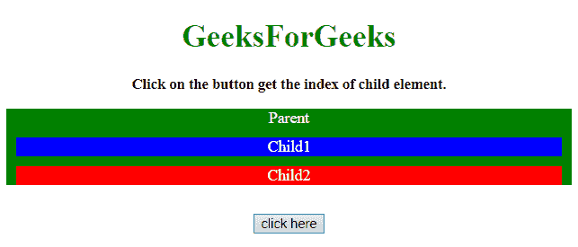
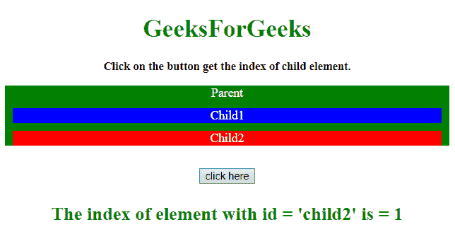

# 如何在 JavaScript 中获取子节点索引？

> 原文:[https://www . geesforgeks . org/如何获取子节点-javascript 中的索引/](https://www.geeksforgeeks.org/how-to-get-the-child-node-index-in-javascript/)

任务是在其他子元素中获取子元素的索引。这里讨论一些技巧。
**进场 1:**

*   选择父元素的子元素。
*   通过**选择父代。parentNode 属性**。
*   使用**array . prototype . indexof . call(Children _ of _ parent，current_child)** 获取索引。

**示例 1:** 该示例使用上述方法。

```
<!DOCTYPE HTML>
<html>

<head>
    <title>
        How to get the child node index in JavaScript?
    </title>
    <style>
        .parent {
            background: green;
            color: white;
        }

        #child1 {
            background: blue;
            color: white;
            margin: 10px;
        }

        #child2 {
            background: red;
            color: white;
            margin: 10px;
        }
    </style>
</head>

<body style="text-align:center;">
    <h1 style="color:green;">  
        GeeksForGeeks  
    </h1>
    <p id="GFG_UP"
       style="font-size: 15px;
              font-weight: bold;">
    </p>
    <div class="parent" id="parent">
        Parent
        <div id="child1">
            Child1
        </div>

        <div id="child2">
            Child2
        </div>
    </div>
    <br>
    <button onclick="GFG_Fun()">
        click here
    </button>

    <p id="GFG_DOWN"
       style="font-size: 24px;
              font-weight: bold;
              color: green;">
    </p>
    <script>
        var up = document.getElementById('GFG_UP');
        var down = document.getElementById('GFG_DOWN');
        up.innerHTML = 
          "Click on the button get the index of child element.";

        function GFG_Fun() {
            var child = document.getElementById('child2');
            var parent = child.parentNode;
            down.innerHTML =
              "The index of element with id = 'child2' is = "
            + Array.prototype.indexOf.call(parent.children, child);
        }
    </script>
</body>

</html>
```

**输出:**

*   **点击按钮前:**
    
*   **点击按钮后:**
    

**方法 2:**

*   选择父元素的子元素。
*   首先选择父元素，然后选择父元素的所有子元素。
*   制作一个子数组，使用 **indexOf()方法**得到索引。

**示例 2:** 该示例使用上述方法。

```
<!DOCTYPE HTML>
<html>

<head>
    <title>
        How to get the child node index in JavaScript?
    </title>
    <style>
        .parent {
            background: green;
            color: white;
        }

        #child1 {
            background: blue;
            color: white;
            margin: 10px;
        }

        #child2 {
            background: red;
            color: white;
            margin: 10px;
        }
    </style>
</head>

<body style="text-align:center;">
    <h1 style="color:green;">  
        GeeksForGeeks  
    </h1>
    <p id="GFG_UP" style="font-size: 15px; font-weight: bold;">
    </p>
    <div class="parent" id="parent">
        Parent
        <div id="child1">
            Child1
        </div>

        <div id="child2">
            Child2
        </div>
    </div>
    <br>
    <button onclick="GFG_Fun()">
        click here
    </button>

    <p id="GFG_DOWN"
       style="font-size: 24px; 
              font-weight: bold;
              color: green;">
    </p>
    <script>
        var up = document.getElementById('GFG_UP');
        var down = document.getElementById('GFG_DOWN');
        up.innerHTML = 
          "Click on the button get the index of child element.";

        function GFG_Fun() {
            var child = document.getElementById('child2');
            down.innerHTML = "The index of element with id = 'child2' is = "
            + Array.from(child.parentNode.children).indexOf(child);
        }
    </script>
</body>

</html>
```

**输出:**

*   **点击按钮前:**
    
*   **点击按钮后:**
    