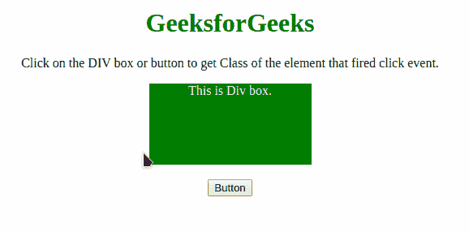

# 如何使用 JavaScript/JQuery 获取已经触发事件的元素的类？

> 原文:[https://www . geesforgeks . org/如何使用 javascript-jquery/](https://www.geeksforgeeks.org/how-to-get-the-class-of-a-element-which-has-fired-an-event-using-javascript-jquery/) 获取已触发事件的元素类

给定一个 HTML 文档和某个触发的事件，任务是获取触发该事件的元素的类。这里讨论了两种方法。

**方法 1:**

*   在本文中，我们只使用点击事件，但是该方法可以应用于任何事件
*   **onCLick()事件**用于此方法。
*   这个 **this.getAttribute('class ')方法**返回发生事件的元素的类。当用户点击任何元素时，这个点击事件就会触发，我们就可以检测到元素的类别。
*   使用 **onCLick =函数(this.getAttribute('class'))** 获取特定元素的类名。

**示例:**该示例实现了上述方法。

```html
<!DOCTYPE html>
<html>
    <head>
        <title>
            Getting the class of the element that
            fired an event using JavaScript.
        </title>
        <style>
            #div {
                background: green;
                height: 100px;
                width: 200px;
                margin: 0 auto;
                color: white;
            }

            #gfg {
                color: green; 
                font-size: 20px; 
                font-weight: bold;
            }
        </style>
    </head>
    <body style="text-align: center;">
        <h1 style="color: green;">
            GeeksforGeeks
        </h1>
        <p>
            Click on the DIV box or button to get Class of 
            the element that fired click event.
        </p>
        <div class="DIV" id="div" 
             onClick="GFG_click(this.getAttribute('class'));">
            This is Div box.
        </div>
        <br />
        <button class="button" id="button"
                onClick="GFG_click(this.getAttribute('class'));">
            Button
        </button>
        <p id="gfg"></p>
        <script>
            var el_down = document.getElementById("gfg");
            function GFG_click(className) {
                // This function is called, when the 
                // click event occurs on any element.
                // get the classname of element.
                el_down.innerHTML = "Class = " + className; 
            }
        </script>
    </body>
</html>
```

**输出:** 

**方法 2:**

*   **onCLick()事件**用于此方法。
*   这个 **$(这个)。attr('class ')方法**返回发生事件的元素的类。无论哪个元素触发了事件，我们都可以检测到它的类。
*   使用 **onCLick =函数($(this)。attr(' class ')**获取触发事件的元素的类名。

**示例:**该示例实现了上述方法。

```html
<!DOCTYPE html>
<html>
    <head>
        <title>
            Getting the class of the element that
            fired an event using JavaScript.
        </title>
        <style>
            #div {
                background: green;
                height: 100px;
                width: 200px;
                margin: 0 auto;
                color: white;
            }
            #gfg {
                color: green;
                font-size: 20px;
                font-weight: bold;
            }
        </style>
        <script src=
"https://ajax.googleapis.com/ajax/libs/jquery/3.4.1/jquery.min.js">
        </script>
    </head>
    <body style="text-align: center;">
        <h1 style="color: green;">
            GeeksforGeeks
        </h1>
        <p>
            Click on the DIV box or button to get 
            Class of the element that fired click event.
        </p>
        <div class="DIV" id="div" 
             onClick="GFG_click($(this).attr('class'));">
            This is Div box.
        </div>
        <br />
        <button class="button" id="button"
                onClick="GFG_click($(this).attr('class'));">
            Button
        </button>
        <p id="gfg"></p>
        <script>
            var el_down = document.getElementById("gfg");
            function GFG_click(className) {
                // This function is called, when the 
                // Click event occurs on any element.
                // Get the class Name.
                el_down.innerHTML = "Class = " + className; 
            }
        </script>
    </body>
</html>
```

**输出:** 