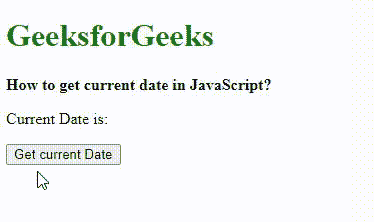
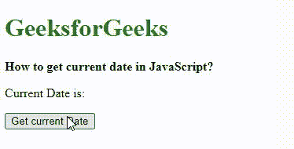

# 如何在 JavaScript 中获取当前日期？

> 原文:[https://www . geesforgeks . org/如何获取当前的 javascript 日期/](https://www.geeksforgeeks.org/how-to-get-the-current-date-in-javascript/)

在本文中，我们将了解如何使用 Javascript 中的内置函数获取当前日期&将通过示例看到它们的实现。执行此任务有两种方法:

*   使用日期()。toDateString()方法
*   使用它们各自的方法获取日、月、年。

还有其他几种方法来执行这个任务，但是在这里，我们将理解用 Javascript 获取当前日期的这两种方法。

**方法一:使用** [**日期()。**](https://www.geeksforgeeks.org/javascript-date-todatestring-method/) **方法:**

**todaytestring()**方法仅用于返回 date 对象的日期部分。前三个字母指定星期几，后三个字母指定月份名称，后两个数字指定月份的日期，最后四个数字指定年份。此方法返回包含上述格式的日期的字符串。这是比对 date()对象中的日期部分进行切片更好的方法。

**语法:**

```
new Date().toDateString();
```

**示例:**此示例描述了 Date()的使用。toDateString()方法获取当前日期。

## 超文本标记语言

```
<!DOCTYPE html>
<html>

<head>
    <title>How to get current date in JavaScript?</title>
</head>

<body>
    <h1 style="color: green">
        GeeksforGeeks
    </h1> 
    <b>How to get current date in JavaScript?</b>

<p> Current Date is: <span class="output"></span></p>

    <button onclick="getCurrentDate()">Get current Date</button>

    <script type="text/javascript">
    function getCurrentDate() {
        let date = new Date().toDateString();
        document.querySelector('.output').textContent = date;
    }
    </script>
</body>

</html>
```

**输出:**



toDateString()方法

**方法二:用各自的方法得到日、月**、**和年:**

日期的所有部分都可以通过各自的方法找到。日可以用 getDate()方法提取，月可以用 getMonth()方法提取，年可以用 getFullYear()方法提取。如果日和月是个位数，则通过将其转换为字符串对象并使用 [padStart()方法](https://www.geeksforgeeks.org/javascript-padstart-method/)用 0 填充。这个方法填充当前字符串，直到得到的字符串达到给定的长度，这里填充长度为 2。最后的日期是通过将所有这些部分按照要求的格式连接起来而构建的。

**语法:**

[**getDate()方法**](https://www.geeksforgeeks.org/javascript-date-getdate-method/) :用于从给定的 Date 对象中获取一个月的日期。

```
let dateObj = new Date();
```

[**getMonth()方法**](https://www.geeksforgeeks.org/javascript-date-getmonth-method/) :用于从给定的 Date 对象中获取月份(0 到 11)。

```
let month = String(dateObj.getMonth() + 1).padStart(2, '0');
```

[**getFullYear()方法**](https://www.geeksforgeeks.org/javascript-date-getfullyear-method/) :它用于从给定的 Date 对象中获取年份。

```
let year = dateObj.getFullYear();
```

要将日期转换为字符串:

```
let day = String(dateObj.getDate()).padStart(2, '0');
```

要以特定格式指定日期:

```
let output = day + '/' + month + '/' + year;
```

**示例:**这个示例描述了使用它们各自的方法获取当前日期。

## 超文本标记语言

```
<!DOCTYPE html>
<html>

<head>
    <title> How to get current date in JavaScript? </title>
</head>

<body>
    <h1 style="color: green">
        GeeksforGeeks
    </h1>
    <b>
        How to get current date in JavaScript?
    </b>

<p> Current Date is: <span class="output"></span> </p>

    <button onclick="getCurrentDate()"> Get current Date </button>

    <script type="text/javascript">
        function getCurrentDate() {
            let dateObj = new Date();
            let month = String(dateObj.getMonth() + 1).padStart(2, '0');
            let day = String(dateObj.getDate()).padStart(2, '0');
            let year = dateObj.getFullYear();
            let output = day + '/' + month + '/' + year;
            document.querySelector('.output').textContent = output;
        }
    </script>
</body>

</html>
```

**输出:**



获取当前日期