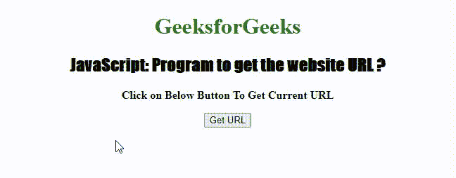

# 如何使用 JavaScript 获取当前 URL？

> 原文:[https://www . geesforgeks . org/如何使用 javascript 获取当前 URL/](https://www.geeksforgeeks.org/how-to-get-the-current-url-using-javascript/)

在本文中，我们将了解如何获取当前网页或网站的网址。当前网址可以通过使用包含当前网址信息的文档对象的[“网址”属性](https://www.geeksforgeeks.org/html-dom-url-property/)获得。“URL”属性返回一个包含当前页面完整位置的字符串，以及包含 HTTP 协议(如 http://)的字符串。

**语法:**

```html
document.URL
```

**返回值:** 返回一个字符串值，代表文档的完整 URL。

**示例:**此示例说明如何获取网页的当前 URL。

## 超文本标记语言

```html
<!DOCTYPE html>
<html>

<head>
    <style>
    h1 {
        color: green;
    }

    h2 {
        font-family: Impact;
    }

    body {
        text-align: center;
    }
    </style>
</head>

<body>
    <h1>GeeksforGeeks</h1>
    <h2>
        JavaScript: Program to 
        get the website URL ?
    </h2>
    <p>
        <b>
            Click on Below Button 
            To Get Current URL
        </b>
    </p>

    <button onclick="GetURL()"> Get URL </button>
    <p id="url"></p>

    <script>
    function GetURL() {
        var gfg = document.URL;
        document.getElementById("url").innerHTML = gfg;
    }
    </script>
</body>

</html>
```

**输出:**



获取当前网站的网址