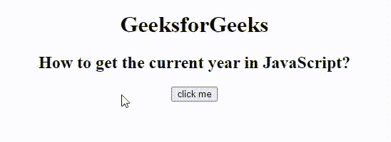

# 如何使用 JavaScript 获取当前年份？

> 原文:[https://www . geesforgeks . org/如何使用 javascript 获取当前年份/](https://www.geeksforgeeks.org/how-to-get-the-current-year-using-javascript/)

在本文中，我们将了解如何使用 Javascript 中的内置方法获取当前年份。目的是通过使用 JavaScript [**getFullYear()方法**](https://www.geeksforgeeks.org/javascript-date-getfullyear-method/) 获取当前年份，该方法将以 4 位格式返回某个指定日期的完整年份。此方法用于从给定的 [**日期**对象](https://www.geeksforgeeks.org/javascript-date-objects/)中获取年份。

**语法**:

```html
DateObject.getFullYear(); 
```

**参数:** 此功能不接受任何参数。

**返回值:** 返回给定日期的年份。

**例:**本例描述获取当前年份。一般用于验证网站上 4 位格式的输入年份。

## 超文本标记语言

```html
<!DOCTYPE html>
<html>

<body style="text-align:center;">
    <h1>GeeksforGeeks</h1>
    <h2>
        How to get the current 
        year in JavaScript?
    </h2>
    <button onclick="geeks()"> click me </button>
    <h4 id="myID"></h4>
    <script>
    function geeks() {

        // Creating Date Object 
        var dateobj = new Date();

        // Year from above object 
        // is being fetched using getFullYear() 
        var dateObject = dateobj.getFullYear();

        // Printing current year 
        document.getElementById("myID").innerHTML = 
        "The Current Year is : " + dateObject;
    }
    </script>
</body>

</html>
```

**输出:**



获取当前年份