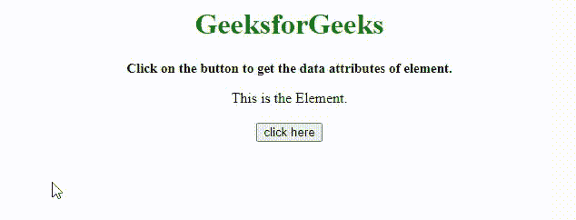
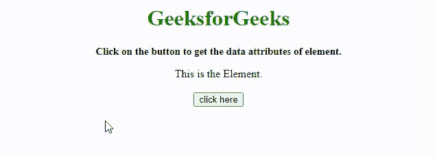

# 如何用 JavaScript 获取一个元素的数据属性？

> 原文:[https://www . geesforgeks . org/如何使用 javascript 获取元素的数据属性/](https://www.geeksforgeeks.org/how-to-get-the-data-attributes-of-an-element-using-javascript/)

在本文中，我们将学习在 Javascript 中获取元素的[数据属性](https://www.geeksforgeeks.org/html-data-attributes/)。给定一个 HTML 文档，任务是使用 JavaScript 选择元素的数据属性。下面给出了解决这个问题的几种方法:

*   使用数据集属性
*   使用 [**。getAttribute()** 方法](https://www.geeksforgeeks.org/html-dom-getattribute-method/)

我们将讨论获取元素数据属性的两种方法。

**进场:**

*   首先，选择具有数据属性的元素。
*   我们可以使用**数据集属性**来访问数据属性，或者使用**。getAttribute()方法**通过专门键入它们的名称来选择它们。

这里，在下面的例子中，我们将使用 [**getElementById()** 方法](https://www.geeksforgeeks.org/html-dom-getelementbyid-method/)，该方法将返回具有给定 Id 的元素，该 ID 被传递给函数。使用[**parsent()**函数](https://www.geeksforgeeks.org/javascript-parseint-function/)接受字符串、基数参数并将其转换为整数。使用 [**JSON.stringify()** 方法](https://www.geeksforgeeks.org/javascript-json-stringify-method/)从中创建一个 JSON 字符串。此方法有助于将对象转换为字符串。

**示例 1:** 本示例使用数据集属性获取元素的**数据属性**。

## 超文本标记语言

```
<!DOCTYPE HTML>
<html>

<head>
    <title>
        How to get the data attributes
        of an element using JavaScript ?
    </title>
</head>

<body align="center">
    <h1 style="color:green;">
        GeeksforGeeks
    </h1>
    <p id="GFG_UP"
       style="font-size: 15px;
              font-weight: bold;">
    </p>

    <span data-typeId="123"
          data-name="name"
          data-points="10"
          data-important="true"
          id="span">This is the Element.

    <br>
    <br>
    <button onclick="GFG_Fun()"> click here </button>
    <p id="GFG_DOWN"
       style="font-size: 20px;
              font-weight: bold;
              color:green;">
    </p>

    <script>
    var el_up = document.getElementById('GFG_UP');
    var el_down = document.getElementById('GFG_DOWN');
    var input = document.getElementById('span');
    el_up.innerHTML = "Click on the button to get "
        + "the data attributes of element.";

    function GFG_Fun() {
        var jsonData = JSON.stringify({
            id: parseInt(input.dataset.typeid),
            points: parseInt(input.dataset.points),
            important: input.dataset.important,
            dataName: input.dataset.name
        });
        el_down.innerHTML = jsonData;
    }
    </script>
</body>

</html>
```

**输出:**



数据集属性

**例 2:** 本例使用 [**。getAttribute()方法**](https://www.geeksforgeeks.org/html-dom-getattribute-method/) 获取一个元素的数据属性。

## 超文本标记语言

```
<!DOCTYPE HTML>
<html>

<head>
    <title>
        How to get the data attributes
        of an element using JavaScript ?
    </title>
</head>

<body align="center">
    <h1 style="color:green;"> 
        GeeksforGeeks 
    </h1>
    <p id="GFG_UP"
       style="font-size: 15px;
              font-weight: bold;">
    </p>

    <span data-typeId="123"
          data-name="name"
          data-points="10"
          data-important="true"
          id="span">This is the Element.

    <br>
    <br>
    <button onclick="GFG_Fun()"> click here </button>
    <p id="GFG_DOWN"
       style="font-size: 20px;
              font-weight: bold;
              color:green;">
    </p>

    <script>
    var el_up = document.getElementById('GFG_UP');
    var el_down = document.getElementById('GFG_DOWN');
    var input = document.getElementById('span');
    el_up.innerHTML = "Click on the button to get "
        + "the data attributes of element.";

    function GFG_Fun() {
        var jsonData = JSON.stringify({
            id: parseInt(input.getAttribute('data-typeId')),
            points: parseInt(input.getAttribute('data-points')),
            important: input.getAttribute('data-important'),
            dataName: input.getAttribute('data-name')
        });
        el_down.innerHTML = jsonData;
    }
    </script>
</body>

</html>
```

**输出:**



。getAttribute()方法