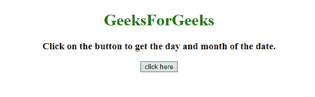
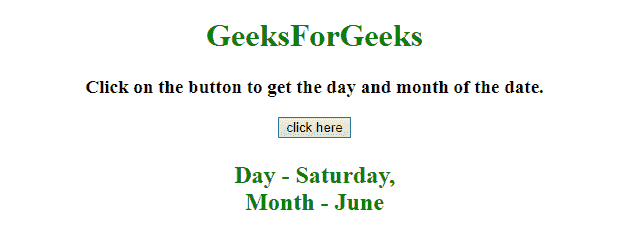
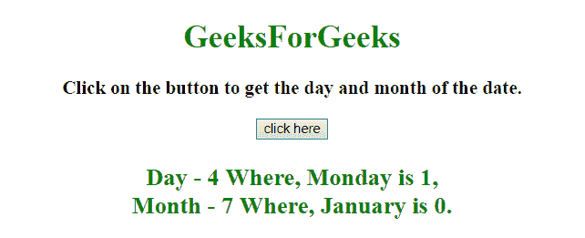

# 如何用 JavaScript 获取一年中的日和月？

> 原文:[https://www . geeksforgeeks . org/如何使用 javascript 获取一年中的日和月/](https://www.geeksforgeeks.org/how-to-get-the-day-and-month-of-a-year-using-javascript/)

给定一个日期，任务是使用 JavaScript 获取一年中的日期和月份。

**进场:**

*   首先使用**新日期()**获取当前日期。
*   使用 **currentDate.getDay()** 获取数字格式的当前日期，映射到日期名称。
*   使用 **currentDate.getMonth()** 获取数字格式的当前月份，映射到月份名称。

**例 1:** 在本例中，月份和日期由上述方法确定。

```
<!DOCTYPE HTML> 
<html> 

<head> 
    <title> 
        How to get the day and month
        of a year using JavaScript ?
    </title>
</head> 

<body style = "text-align:center;"> 

    <h1 style = "color:green;" > 
        GeeksForGeeks
    </h1>

    <p id = "GFG_UP" style =
        "font-size: 19px; font-weight: bold;">
    </p>

    <button onclick = "GFG_Fun()">
        click here
    </button>

    <p id = "GFG_DOWN" style =
        "color: green; font-size: 24px; font-weight: bold;">
    </p>

    <script>
        var el_up = document.getElementById("GFG_UP");
        var el_down = document.getElementById("GFG_DOWN");

        el_up.innerHTML = "Click on the button to get "
                + "the day and month of the date.";

        var Days = ['Sunday', 'Monday', 'Tuesday', 
                'Wednesday', 'Thursday', 'Friday', 'Saturday'];

        var Months = ['January', 'February', 'March', 'April', 
                'May', 'June', 'July', 'August', 'September',
                'October', 'November', 'December'];

        var currentDay = new Date();

        // Get the current day name
        var day = Days[currentDay.getDay()];

        // Get the current month name
        var month = Months[currentDay.getMonth()]; 

        function GFG_Fun() {
            el_down.innerHTML = "Day - " + day
                    + ",<br> Month - " + month;
        }
    </script> 
</body> 

</html>
```

**输出:**

*   **点击按钮前:**
    
*   **点击按钮后:**
    

**示例 2:** 这是同一个示例，但方法不同。在本例中，月份和日期由上述方法确定。

```
<!DOCTYPE HTML> 
<html> 

<head> 
    <title> 
        How to get the day and month of
        a year using JavaScript ?
    </title>
</head> 

<body style = "text-align:center;"> 

    <h1 style = "color:green;" > 
        GeeksForGeeks
    </h1>

    <p id = "GFG_UP" style =
        "font-size: 19px; font-weight: bold;">
    </p>

    <button onclick = "GFG_Fun()">
        click here
    </button>

    <p id = "GFG_DOWN" style =
        "color: green; font-size: 24px; font-weight: bold;">
    </p>

    <script>
        var el_up = document.getElementById("GFG_UP");
        var el_down = document.getElementById("GFG_DOWN");

        el_up.innerHTML = "Click on the button to get the "
                    + "day and month of the date.";

        var currentDay = new Date();

        // Get the current day name
        var day = currentDay.getDay(); 

        // Getting the current month name
        var month = currentDay.getMonth(); 

        function GFG_Fun() {
            el_down.innerHTML = "Day - " + day + 
                    " Where, Monday is 1,<br> Month - "
                    + month +" Where, January is 0.";
        }
    </script> 
</body> 

</html>
```

**输出:**

*   **点击按钮前:**
    
*   **点击按钮后:**
    