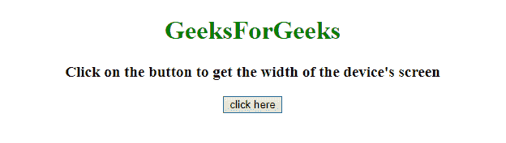
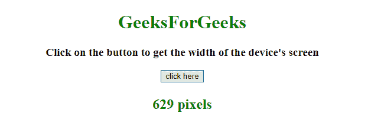

# 如何在 JavaScript 中获取设备屏幕的宽度？

> 原文:[https://www . geesforgeks . org/如何获取设备屏幕宽度如何获取设备屏幕宽度 javascript/](https://www.geeksforgeeks.org/how-to-get-the-device-screhow-to-get-the-width-of-device-screen-in-javascript-en-width-in-javascript/)

给定一个运行在设备上的 HTML 文档。任务是使用 JavaScript 找到工作屏幕设备的宽度。

**示例 1:** 本示例使用 window.innerWidth 获取设备屏幕的宽度。innerWidth 属性用于返回设备的宽度。

```
<!DOCTYPE HTML> 
<html> 
    <head> 
        <title> 
            How to get the device screen width in JavaScript ?
        </title>
    </head> 

    <body style = "text-align:center;"> 

        <h1 style = "color:green;" > 
            GeeksForGeeks
        </h1>

        <p id = "GFG_UP" style = 
            "font-size: 19px; font-weight: bold;">
        </p>

        <button onclick = "GFG_Fun()">
            click here
        </button>

        <p id = "GFG_DOWN" style =
            "color: green; font-size: 24px; font-weight: bold;">
        </p>

        <!-- Script to display the device screen width -->
        <script>
            var el_up = document.getElementById("GFG_UP");
            var el_down = document.getElementById("GFG_DOWN");

            el_up.innerHTML = "Click on the button to get the"
                    + " width of the device's screen"; 

            function GFG_Fun() {
                var width = window.innerWidth;
                el_down.innerHTML = width + " pixels";
            }
        </script> 
    </body> 
</html>                    
```

**输出:**

*   **点击按钮前:**
    
*   **点击按钮后:**
    

**示例 2:** 本示例使用 document . document element . client width 方法获取设备屏幕的宽度。

```
<!DOCTYPE HTML> 
<html> 
    <head> 
        <title> 
            How to get the device screen width in JavaScript ?
        </title>
    </head> 

    <body style = "text-align:center;"> 

        <h1 style = "color:green;" > 
            GeeksForGeeks
        </h1>

        <p id = "GFG_UP" style = 
            "font-size: 19px; font-weight: bold;">
        </p>

        <button onclick = "GFG_Fun()">
            click here
        </button>

        <p id = "GFG_DOWN" style =
            "color: green; font-size: 24px; font-weight: bold;">
        </p>

        <!-- Script to display the device screen width -->
        <script>
            var el_up = document.getElementById("GFG_UP");
            var el_down = document.getElementById("GFG_DOWN");

            el_up.innerHTML = "Click on the button to get the"
                    + " width of the device's screen"; 

            function GFG_Fun() {
                el_down.innerHTML =
                    document.documentElement.clientWidth + " pixels";
            }
        </script> 
    </body> 
</html>
```

**输出:**

*   **点击按钮前:**
    
*   **点击按钮后:**
    