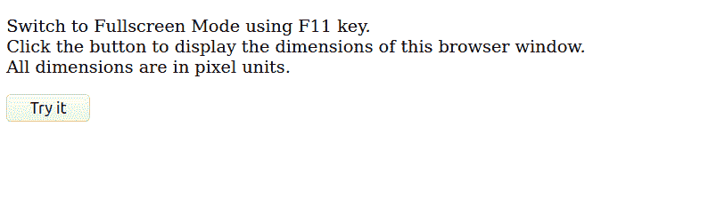
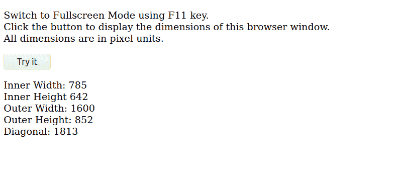

# 如何用 JavaScript 获取设备屏幕对角线长度？

> 原文:[https://www . geesforgeks . org/如何使用 javascript 获取设备屏幕对角线长度/](https://www.geeksforgeeks.org/how-to-get-the-diagonal-length-of-the-device-screen-using-javascript/)

了解浏览器窗口的宽度和高度有助于 web 开发人员增强用户体验。它可以帮助改进浏览器动画以及分区和容器的相对定位。Javascript 提供了一个**窗口对象**，代表一个打开的浏览器窗口。它提供了定义浏览器窗口尺寸的各种属性。它们如下:

*   **innerWidth:** 返回窗口内容区域的宽度。
*   **innerHeight:** 返回窗口内容区域的高度。
*   **外部宽度:**返回浏览器窗口的宽度。
*   **外部高度:**返回浏览器窗口的高度。

**注:**这些尺寸以像素为单位。

因为像素是维度上的正方形单元。你无法准确说出对角线上有多少像素。您可以通过使用浏览器的高度和宽度并应用毕达哥拉斯定理来近似对角线。

**勾股定理:**对于直角三角形，斜边的平方就是底边的平方和高度的平方之和。
T3】

类似于上述公式，**对角线= squared_root(width^2+height^2)**。

**代码片段:**

```html
<script>
function myFunction() {
  var w = window.outerWidth;
  var h = window.outerHeight;
  var d = Math.sqrt(w*w + h*h);
  console.log('Width: ' + w);
  console.log('Height: ' + h);
  console.log('Diagonal: ' + Math.ceil(d));
}
</script>
```

上面的代码将在控制台窗口中打印浏览器的高度和宽度。可以使用浏览器中的开发人员工具打开控制台窗口。
**注意:要获取完整的屏幕尺寸，请将浏览器切换到全屏模式。大多数浏览器使用 F11 键切换全屏模式。**

下面的代码使用 Javascript 的 innerHTML 属性在浏览器窗口上显示结果。

```html
<!DOCTYPE html>
<html>

<body>

    <p>
        Switch to Fullscreen Mode using the F11 key.
        <br>Click the button to display the dimensions 
        of this browser window.<br> All dimensions 
        are in pixel units.
    </p>

    <button onclick="myFunction()">Try it</button>

    <p id="demo"></p>

    <script>
        function myFunction() {
            var i_w = window.innerWidth;
            var i_h = window.innerHeight;
            var o_w = window.outerWidth;
            var o_h = window.outerHeight;
            var d = Math.sqrt(o_w * o_w + o_h * o_h);

            document.getElementById("demo").innerHTML
                = "Inner Width: " + i_w +
                "<br>Inner Height " + i_h + "<br>Outer Width: "
                + o_w + "<br>Outer Height: " +
                o_h + "<br>Diagonal: " + Math.ceil(d);
        }
    </script>
</body>

</html>
```

**输出:**

*   **按下‘试试看’按钮前:**
    
*   **按下【试试看】按钮后:**
    

**注意:**如果你知道你的显示器屏幕的线性像素密度，你可以把上面代码得到的尺寸除以密度，得到厘米或英寸的尺寸。