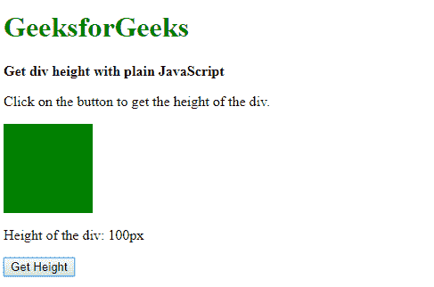
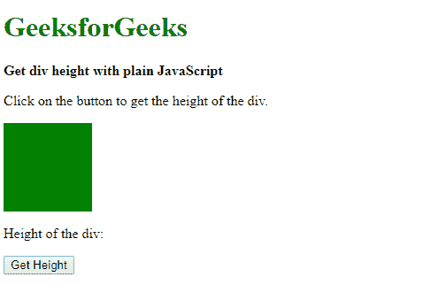

# 如何使用 JavaScript 获取高度？

> 原文: [https://www .极客们。组织/如何划分高度-使用-JavaScript/](https://www.geeksforgeeks.org/how-to-get-the-div-height-using-javascript/)

**方法 1:使用 offsetHeight 属性:**元素的 offsetHeight 属性是只读属性，用于以像素为单位返回元素的高度。它包括元素的任何边框或填充。此属性可用于查找< div >元素的高度。

**语法:**

```
divElement.offsetHeight
```

**示例:**

```
<!DOCTYPE html>
<html>

<head>
    <title>
        How to get the div height
        using JavaScript ?
    </title>

    <style>
        .box {
            height: 100px;
            width: 100px;
            background-color: green;
            display:inline-block;
        }
    </style>
</head>

<body style="text-align:center;">
    <h1 style="color: green">
        GeeksforGeeks
    </h1>

    <b>
        Get the height of <div>
        element using JavaScript
    </b>

    <p>
        Click on the button to get the height 
        of <div> element
    </p>

    <div class="box"></div>

    <p>
        Height of the div: 
        <span class="output"></span>
    </p>

    <button onclick="getHeight()">
        Get Height
    </button>

    <script type="text/javascript">
        function getHeight() {

            divElement = document.querySelector(".box");

            elemHeight = divElement.offsetHeight;

            document.querySelector(".output").textContent
                    = elemHeight + "px";
        }
    </script>
</body>

</html>
```

**输出:**

*   **Before clicking the button:**
    
*   **Click the button:**
    

**方法 2:使用 clientHeight 属性:**client height 它只包括应用于元素的填充，不包括边框、边距或水平滚动条。此属性可用于查找 div 元素的高度。

**语法:**

```
divElement.clientHeight
```

**示例:**

```
<!DOCTYPE html>
<html>

<head>
    <title>
        How to get the div height
        using JavaScript ?
    </title>

    <style>
        .box {
            height: 100px;
            width: 100px;
            background-color: green;
            display:inline-block;
        }
    </style>
</head>

<body style="text-align:center;">
    <h1 style="color: green">
        GeeksforGeeks
    </h1>

    <b>
        Get the height of <div>
        element using JavaScript
    </b>

    <p>
        Click on the button to get the height 
        of <div> element
    </p>

    <div class="box"></div>

    <p>
        Height of the div: 
        <span class="output"></span>
    </p>

    <button onclick="getHeight()">
        Get Height
    </button>

    <script type="text/javascript">
        function getHeight() {

            divElement = document.querySelector(".box");

            elemHeight = divElement.clientHeight;

            document.querySelector(".output").textContent
                    = elemHeight + "px";
        }
    </script>
</body>

</html>
```

**输出:**

*   **Before clicking the button:**
    
*   **Click the button:**

T73
DOM rect 对象的这些属性之一是高度属性。它返回 DOMRect 对象的高度。此属性可用于查找 div 元素的高度。

**语法:**

```
elemRect = divElement.getBoundingClientRect();
elemHeight = elemRect.height;
```

**示例:**

```
<!DOCTYPE html>
<html>

<head>
    <title>
        How to get the div height
        using JavaScript ?
    </title>

    <style>
        .box {
            height: 100px;
            width: 100px;
            background-color: green;
            display:inline-block;
        }
    </style>
</head>

<body style="text-align:center;">
    <h1 style="color: green">
        GeeksforGeeks
    </h1>

    <b>
        Get the height of <div>
        element using JavaScript
    </b>

    <p>
        Click on the button to get the height 
        of <div> element
    </p>

    <div class="box"></div>

    <p>
        Height of the div: 
        <span class="output"></span>
    </p>

    <button onclick="getHeight()">
        Get Height
    </button>

    <script type="text/javascript">
        function getHeight() {

            divElement = document.querySelector(".box");

            elemRect = divElement.getBoundingClientRect();

            elemHeight = elemRect.height;

            document.querySelector(".output").textContent
                    = elemHeight + "px";
        }
    </script>
</body>

</html>
```

**输出:**

*   **Before clicking the button:**
    
*   Click the button:
    