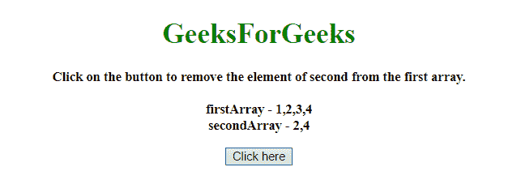
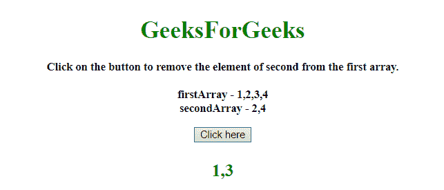

# 如何用 JavaScript 获取一个数组中不存在于另一个数组中的元素？

> 原文:[https://www . geeksforgeeks . org/如何使用 javascript 获取一个数组中不存在于另一个数组中的元素/](https://www.geeksforgeeks.org/how-to-get-the-elements-of-one-array-which-are-not-present-in-another-array-using-javascript/)

任务是获取一个数组中不存在于另一个数组中的元素。在这里，我们将使用 JavaScript 来实现这个目标。这里讨论一些技巧。
**进场**

*   以变量中的数组为例。
*   使用**。filter()方法**在第一个数组上，检查第一个数组的元素是否不在第二个数组中，将那些元素包含在输出中。

**示例 1:** 该示例使用上述方法。

```
<!DOCTYPE HTML>
<html>

<head>
    <title>
        How to get the elements of one array which 
      are not present in another array using JavaScript?
    </title>
</head>

<body style="text-align:center;" id="body">
    <h1 id="h1" style="color:green;">  
            GeeksForGeeks  
        </h1>
    <p id="GFG_UP" 
       style="font-size: 15px; 
              font-weight: bold;">
    </p>
    <button onclick="gfg_Run()">
        Click here
    </button>
    <p id="GFG_DOWN" 
       style="font-size: 23px;
              font-weight: bold;
              color: green; ">
    </p>
    <script>
        var el_up = document.getElementById("GFG_UP");
        var el_down = document.getElementById("GFG_DOWN");
        var ar1 = [1, 2, 3, 4];
        var ar2 = [2, 4];
        el_up.innerHTML = 
          "Click on the button to remove the element of "+
          "second from the first array.<br><br> firstArray - " + 
          ar1 + "<br>secondArray - " + ar2;

        function gfg_Run() {
            var elmts = ar1.filter(
                function(i) {
                    return this.indexOf(i) < 0;
                },
                ar2
            );
            el_down.innerHTML = elmts;
        }
    </script>
</body>

</html>
```

**输出:**

*   **点击按钮前:**
    
*   **点击按钮后:**
    

**示例 2:** 这个示例使用了相同的方法，但是 javaScript 的方法不同。

```
<!DOCTYPE HTML>
<html>

<head>
    <title>
        How to get the elements of one array 
      which are not present in another array using JavaScript?
    </title>
</head>

<body style="text-align:center;" id="body">
    <h1 id="h1" style="color:green;">  
            GeeksForGeeks  
        </h1>
    <p id="GFG_UP" style="font-size: 15px; font-weight: bold;">
    </p>
    <button onclick="gfg_Run()">
        Click here
    </button>
    <p id="GFG_DOWN" 
       style="font-size: 23px;
              font-weight: bold;
              color: green; ">
    </p>
    <script>
        var el_up = document.getElementById("GFG_UP");
        var el_down = document.getElementById("GFG_DOWN");
        var ar1 = [1, 2, 3, 4];
        var ar2 = [2, 4];
        el_up.innerHTML = 
          "Click on the button to remove the element of second"+
          " from the first array.<br><br> firstArray - " 
        + ar1 + "<br>secondArray - " + ar2;

        function gfg_Run() {
            var elmts = ar1.filter(f => !ar2.includes(f));
            el_down.innerHTML = elmts;
        }
    </script>
</body>

</html>
```

**输出:**

*   **点击按钮前:**
    
*   **点击按钮后:**
    