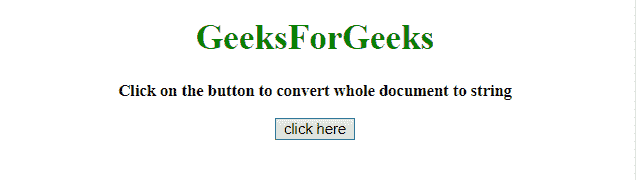
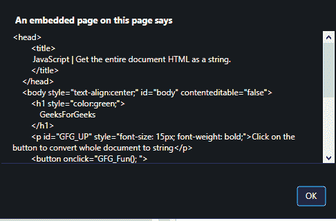

# 如何在 JavaScript 中将整个 HTML 文档作为字符串获取？

> 原文:[https://www . geesforgeks . org/如何将整个 html 文档作为 javascript 字符串/](https://www.geeksforgeeks.org/how-to-get-the-entire-html-document-as-a-string-in-javascript/)

给定一个 HTML 文档，任务是使用 JavaScript 将整个文档作为字符串获取。这里讨论几个方法:

*   **getElementsByTagName()方法**
    这个方法返回一组文档中所有元素的定义标签名，作为 NodeList 对象。
    该对象表示节点集合，通过索引号进行访问。索引从 0 开始。
    **语法:**

```
document.getElementsByTagName(tagname)
```

*   **参数:**
    *   **标记名:**此参数是必需的。它指定要获取的元素的标记名。

*   **HTML DOM innerHTML 属性**
    该属性设置/返回元素的 HTML 内容(内部 HTML)。
    **语法:**
    *   **返回 innerHTML 属性:**

```
HTMLElementObject.innerHTML
```

*   **设置 innerHTML 属性:**

```
HTMLElementObject.innerHTML = text
```

*   **文本:**指定元素的 HTML 内容。

**示例 1:** 本示例使用**document . document element . innerhtml**将整个文档作为字符串获取。

## 超文本标记语言

```
<!DOCTYPE html> 
<html>

<head>
    <title>
        JavaScript | Get the entire document HTML as a string.
    </title>
</head>

<body style="text-align:center;" id="body">
    <h1 style="color:green;"> 
            GeeksforGeeks 
        </h1>
    <p id="GFG_UP" style="font-size: 15px; font-weight: bold;">
    </p>

    <button onclick="GFG_Fun(); ">
        click here
    </button>
    <script>
        var up = document.getElementById('GFG_UP');
        up.innerHTML = 'Click on the button to convert whole document to string';

        function GFG_Fun() {
            var string = document.documentElement.innerHTML;
            alert(string);
        }
    </script>
</body>

</html>
```

**输出:**

*   **点击按钮前:**



*   **点击按钮后:**



**示例 2:** 本示例通过首先选择标记名为“HTML”的元素，然后使用**document . getelementsbytagname(‘HTML’)【0】索引选择第一个元素来获取整个文档。innerHTML** 。

## 超文本标记语言

```
<!DOCTYPE html> 
<html>

<head>
    <title>
        JavaScript | Get the entire document HTML as a string.
    </title>
</head>

<body style="text-align:center;" id="body">
    <h1 style="color:green;"> 
            GeeksforGeeks 
        </h1>
    <p id="GFG_UP" style="font-size: 15px; font-weight: bold;">
    </p>

    <button onclick="GFG_Fun(); ">
        click here
    </button>
    <script>
        var up = document.getElementById('GFG_UP');
        up.innerHTML = 'Click on the button to convert whole document to string';

        function GFG_Fun() {
            var string = document.getElementsByTagName('html')[0].innerHTML;
            alert(string);
        }
    </script>
</body>

</html>
```

**输出:**

*   **点击按钮前:**


*   **点击按钮后:**


**支持的浏览器:**

*   谷歌 Chrome
*   Mozilla Firefox
*   微软公司出品的 web 浏览器
*   旅行队
*   歌剧