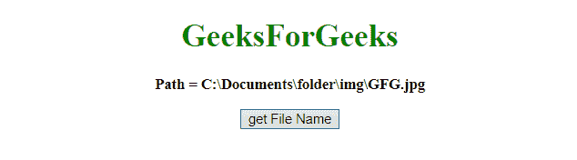
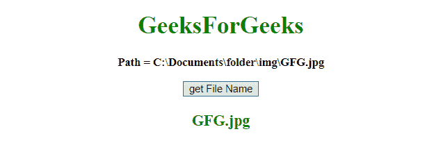

# 如何用 JavaScript 从全路径获取文件名？

> 原文:[https://www . geesforgeks . org/如何使用 javascript 从完整路径获取文件名/](https://www.geeksforgeeks.org/how-to-get-the-file-name-from-full-path-using-javascript/)

给定一个包含文件路径的文件名，任务是从完整路径中获取文件名。下面列出了解决这个问题的几种方法:

*   **replace() method:** This method searches a string for a defined value, or a regular expression, and returns a new string with the replaced defined value.

    **语法:**

    ```
    string.replace(searchVal, newvalue)
    ```

    **参数:**该方法接受两个参数，如上所述，如下所述:

    *   **搜索值:**此参数为必填项。它指定将被新值替换的值或正则表达式。
    *   **新值:**此参数为必填项。它指定要用搜索值替换的值。

    **返回值:**它返回一个新字符串，其中定义的值已被新值替换。

*   **split() method:** This method is used to split a string into an array of substrings, and returns the new array.

    **语法:**

    ```
    string.split(separator, limit)
    ```

    **参数:**该方法接受两个参数，如上所述，如下所述:

    *   **分隔符:**此参数为可选。它指定用于拆分字符串的字符或正则表达式。如果不使用，将返回整个字符串(只有一项的数组)。
    *   **极限:**此参数为可选。它指定指定拆分次数的整数，超出拆分限制的项目将从数组中排除。

    **返回值:**返回一个新数组，包含拆分后的项目。

*   **JavaScript Array pop() Method:** This method deletes the last element of an array, and returns deleted element.

    **语法:**

    ```
    array.pop()
    ```

    **返回值:**返回任意类型，代表删除的数组项。该项可以是字符串、数字、数组、布尔值或数组中允许的任何其他对象类型。

**示例 1:** 本示例使用 **replace()方法**借助**正则表达式**获取文件名。

```
<!DOCTYPE HTML> 
<html> 
    <head> 
        <title> 
            How to get the file name from a
            full path using JavaScript
        </title>
    </head> 

    <body style = "text-align:center;"> 

        <h1 style = "color:green;" > 
            GeeksForGeeks 
        </h1>

        <p id = "GFG_UP" style =
            "font-size: 15px; font-weight: bold;">
        </p>

        <button onclick = "gfg_Run()"> 
            get File Name
        </button>

        <p id = "GFG_DOWN" style = 
            "color:green; font-size: 20px; font-weight: bold;">
        </p>

        <script>
            var el_up = document.getElementById("GFG_UP");
            var el_down = document.getElementById("GFG_DOWN");
            var path = "Path = " +
                    "C:\\Documents\\folder\\img\\GFG.jpg";

            el_up.innerHTML = path;

            function gfg_Run() {
                el_down.innerHTML = path.replace(/^.*[\\\/]/, '');
            }         
        </script> 
    </body> 
</html>
```

**输出:**

*   **点击按钮前:**
    
*   **点击按钮后:**
    

**例 2:** 本例借助重复的 **split()** 和 **pop()** 方法获取文件名。

```
<!DOCTYPE HTML> 
<html> 
    <head> 
        <title> 
            How to get the file name from a
            full path using JavaScript
        </title>
    </head> 

    <body style = "text-align:center;"> 

        <h1 style = "color:green;" > 
            GeeksForGeeks 
        </h1>

        <p id = "GFG_UP" style = 
            "font-size: 15px; font-weight: bold;">
        </p>

        <button onclick = "gfg_Run()"> 
            get File Name
        </button>

        <p id = "GFG_DOWN" style =
            "color:green; font-size: 20px; font-weight: bold;">
        </p>

        <script>
            var el_up = document.getElementById("GFG_UP");
            var el_down = document.getElementById("GFG_DOWN");
            var path = "Path = " + 
                    "C:\\Documents\\folder\\img\\GFG.jpg";
            el_up.innerHTML = path;

            function gfg_Run() {
                el_down.innerHTML
                    = path.split('\\').pop().split('/').pop();
            }         
        </script> 
    </body> 
</html>                    
```

**输出:**

*   **点击按钮前:**
    
*   **点击按钮后:**
    