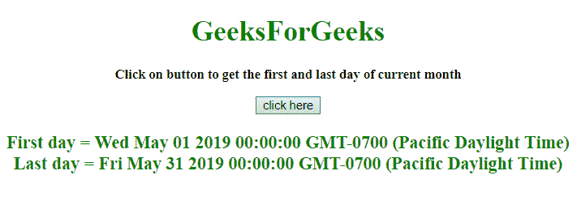

# 如何用 JavaScript 获取当月的第一个和最后一个日期？

> 原文:[https://www . geesforgeks . org/如何使用 javascript 获取当前月份的第一个和最后一个日期/](https://www.geeksforgeeks.org/how-to-get-the-first-and-last-date-of-current-month-using-javascript/)

给定一个月，任务是使用 JavaScript 以适当的格式确定该月的第一天和最后一天。

*   **JavaScript getDate() Method:** This method returns the day of the month (from 1 to 31) for the defined date.

    **语法:**

    ```
    Date.getDate()
    ```

    **返回值:**返回 1 到 31 之间的数字，代表一个月中的某一天。

*   **JavaScript getFullYear() Method:** This method returns the year (four digits for dates between year 1000 and 9999) of the defined date.

    **语法:**

    ```
    Date.getFullYear()
    ```

    **返回值:**返回一个数字，代表定义日期的年份。

*   **JavaScript getMonth() Method:** This method returns the month (from 0 to 11) for the defined date, based on to local time.

    **语法:**

    ```
    Date.getMonth()
    ```

    **返回值:**返回一个数字，从 0 到 11，代表月份。

**示例 1:** 本示例通过使用 **getFullYear()和 getMonth()方法**获取当前日期的年和月来设置 var firstDay 和 lastDay 的日期，然后获取该月的第一天和最后一天。

```
<!DOCTYPE HTML> 
<html> 
    <head> 
        <title> 
            Get first and last date of current month
        </title>     
    </head> 

    <body style = "text-align:center;"> 

        <h1 style = "color:green;" > 
            GeeksForGeeks 
        </h1>

        <p id = "GFG_UP" style = 
            "font-size: 15px; font-weight: bold;">
        </p>

        <button onclick = "GFG_Fun()">
            click here
        </button>

        <p id = "GFG_DOWN" style = 
            "color:green; font-size: 20px; font-weight: bold;">
        </p>

        <script>
            var up = document.getElementById('GFG_UP');

            up.innerHTML = "Click on button to get the first "
                    + "and last day of current month";

            var down = document.getElementById('GFG_DOWN'); 

            function GFG_Fun() {
                var date = new Date();

                var firstDay = 
                    new Date(date.getFullYear(), date.getMonth(), 1);

                var lastDay = 
                   new Date(date.getFullYear(), date.getMonth() + 1, 0);

                down.innerHTML = "First day = " + firstDay +
                            "<br>Last day = " + lastDay;
            }
        </script> 
    </body> 
</html>                    
```

**输出:**

*   **点击按钮前:**
    
*   **点击按钮后:**
    

**例 2:** 本例与上例相似。此示例还通过使用 **getFullYear()和 getMonth()方法**获取当前日期的年和月来设置 var 的第一天和最后一天的日期，然后通过不同的方法获取该月的第一天和最后一天。

```
<!DOCTYPE HTML> 
<html> 
    <head> 
        <title> 
            Get first and last date of current month
        </title>     
    </head> 

    <body style = "text-align:center;"> 

        <h1 style = "color:green;" > 
            GeeksForGeeks 
        </h1>

        <p id = "GFG_UP" style = 
            "font-size: 15px; font-weight: bold;">
        </p>

        <button onclick = "GFG_Fun()">
            click here
        </button>

        <p id = "GFG_DOWN" style = 
            "color:green; font-size: 20px; font-weight: bold;">
        </p>

        <script>
            var up = document.getElementById('GFG_UP');

            up.innerHTML = "Click on button to get the first "
                    + "and last day of current month";

            var down = document.getElementById('GFG_DOWN'); 

            function daysInMonth (month, year) {
                return new Date(year, month, 0).getDate();
            }

            function GFG_Fun() {
                var date = new Date();
                var firstDay = new Date(date.getFullYear(),
                                date.getMonth(), 1);

                var lastDay = new Date(date.getFullYear(),
                        date.getMonth(), daysInMonth(date.getMonth()+1,
                        date.getFullYear()));

                down.innerHTML = "First day = " + firstDay +
                            "<br>Last day = " + lastDay;
            }
        </script> 
    </body> 
</html>                    
```

**输出:**

*   **点击按钮前:**
    
*   **点击按钮后:**
    