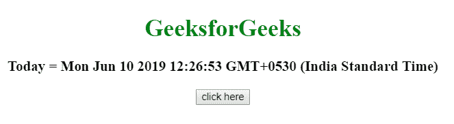
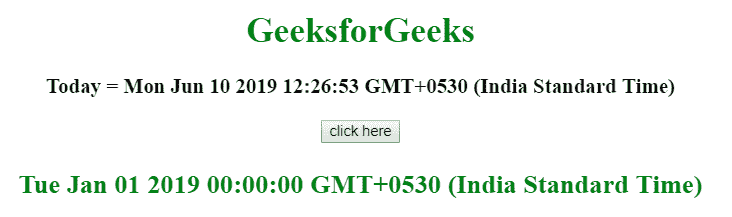
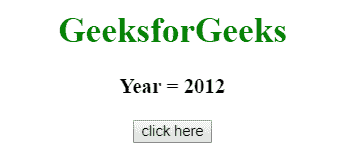
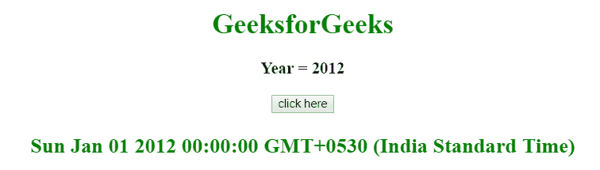

# 如何在 JavaScript 中获取一年的第一天？

> 原文:[https://www . geesforgeks . org/如何用 javascript 获得一年中的第一天/](https://www.geeksforgeeks.org/how-to-get-the-first-day-of-the-year-in-javascript/)

给定一个日期/年份，任务是使用 JavaScript 获取一年中的第一天。

**方法 1:**

*   使用 [getFullYear()方法](https://www.geeksforgeeks.org/javascript-date-getfullyear-function/)从给定日期获取年份。
*   使用新的 Date()函数使用年、月和日创建新的日期对象。

**示例:**本示例使用 getFullYear()方法获取当天的整年，然后获取当年的第一天。

```
<!DOCTYPE HTML> 
<html> 
    <head> 
        <title> 
            How to get the first day of
            the year in JavaScript ?
        </title>
    </head> 

    <body style = "text-align:center;"> 

        <h1 style = "color:green;" > 
            GeeksForGeeks 
        </h1>

        <p id = "GFG_UP" style =
            "font-size: 19px; font-weight: bold;">
        </p>

        <button onClick = "GFG_Fun()">
            click here
        </button>

        <p id = "GFG_DOWN" style =
            "color: green; font-size: 24px; font-weight: bold;">
        </p>

        <script>
            var up = document.getElementById('GFG_UP');
            var down = document.getElementById('GFG_DOWN');

            var date = new Date();

            up.innerHTML = "Today = "+ date;

            function GFG_Fun() {

                // Use Date(year, month, day) function
                down.innerHTML = new Date(date.getFullYear(), 0, 1);
            }
        </script> 
    </body> 
</html>                    
```

**输出:**

*   **点击按钮前:**
    
*   **点击按钮后:**
    

**方法 2:**

*   将年份初始化为变量(年份= 2012)。
*   使用新的 Date()函数使用年、月和日创建新的日期对象。

**例:**本例使用 2012 年，然后得到该年的第一天。

```
<!DOCTYPE HTML> 
<html> 
    <head> 
        <title> 
            How to get the first day of
            the year in JavaScript ?
        </title>
    </head> 

    <body style = "text-align:center;"> 

        <h1 style = "color:green;" > 
            GeeksForGeeks 
        </h1>

        <p id = "GFG_UP" style =
            "font-size: 19px; font-weight: bold;">
        </p>

        <button onClick = "GFG_Fun()">
            click here
        </button>

        <p id = "GFG_DOWN" style =
            "color: green; font-size: 24px; font-weight: bold;">
        </p>

        <script>
            var up = document.getElementById('GFG_UP');
            var down = document.getElementById('GFG_DOWN');

            // Declare year and initialize it
            var year = 2012;

            up.innerHTML = "Today's year = "+ year;

            function GFG_Fun() {

                // Use Date(year, month, day) function
                // to get the first day of year
                down.innerHTML = new Date(year, 0, 1);
            }
        </script> 
    </body> 
</html>                    
```

**输出:**

*   **点击按钮前:**
    
*   **点击按钮后:**
    