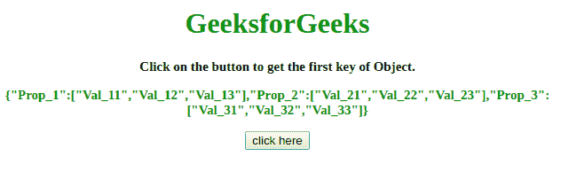
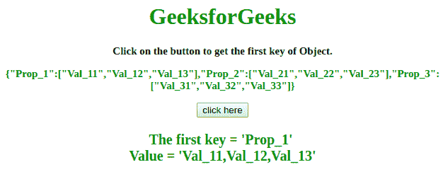
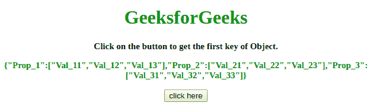
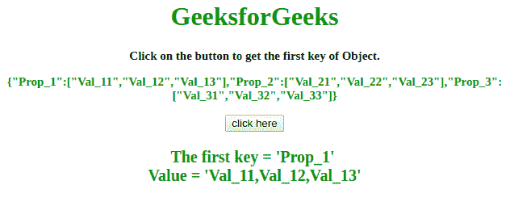

# 如何获取一个 JavaScript 对象的首键名？

> 原文:[https://www . geesforgeks . org/如何获取 javascript 对象的第一个键名/](https://www.geeksforgeeks.org/how-to-get-the-first-key-name-of-a-javascript-object/)

给定一个对象，任务是获取一个 JavaScript 对象的第一个键。由于 JavaScript 对象不包含编号索引，因此我们使用以下方法来获取对象的第一个键名。

**方法 1:**

*   首先将 JavaScript 对象放入一个变量中。
*   使用[**object . keys(object name)**](https://www.geeksforgeeks.org/object-keys-javascript/)方法访问对象的所有键。
*   现在，我们可以使用像**object . keys(object name)[0]**这样的索引来获取对象的第一个元素的键。

**示例:**该示例说明了上述方法。

```
<!DOCTYPE HTML> 
<html> 

<head> 
    <title> 
        How to get the first key name
        of a JavaScript object ?
    </title>     
</head> 

<body style = "text-align:center;"> 

    <h1 style = "color:green;" > 
        GeeksforGeeks 
    </h1> 

    <p id = "GFG_UP1" style = 
        "font-size: 15px; font-weight: bold;"> 
    </p>

    <p id = "GFG_UP2" style = 
        "font-size: 15px; font-weight: bold; color: green;"> 
    </p>

    <button onclick = "GFG_Fun()"> 
        click here 
    </button> 

    <p id = "GFG_DOWN" style = 
        "color:green; font-size: 20px; font-weight: bold;"> 
    </p> 

    <script> 
        var up1 = document.getElementById('GFG_UP1'); 
        var up2 = document.getElementById('GFG_UP2'); 
        var down = document.getElementById('GFG_DOWN');

        var obj = { 
            "Prop_1": ["Val_11", "Val_12", "Val_13"], 
            "Prop_2": ["Val_21", "Val_22", "Val_23"], 
            "Prop_3": ["Val_31", "Val_32", "Val_33"]
        };

        up1.innerHTML = "Click on the button to get the "+
                                "first key of Object.";

        up2.innerHTML = JSON.stringify(obj); 

        function GFG_Fun() {
            down.innerHTML = "The first key = '" + 
            Object.keys(obj)[0] + "' <br> Value = '"
            + obj[Object.keys(obj)[0]] + "'";
        } 
    </script> 
</body> 

</html>   
```

**输出:**

*   **点击按钮前:**
    
*   **点击按钮后:**
    

**方法 2:**

*   首先将 JavaScript 对象放入一个变量中。
*   借助循环，开始访问 JavaScript 对象的所有键。
*   运行一次后，打破它。然后我们将获得对象的第一个键。

**示例:**该示例说明了上述方法。

```
<!DOCTYPE HTML> 
<html> 

<head> 
    <title> 
        How to get the first key name
        of a JavaScript object ?
    </title>     
</head> 

<body style = "text-align:center;"> 

    <h1 style = "color:green;" > 
        GeeksforGeeks 
    </h1> 

    <p id = "GFG_UP1" style = 
        "font-size: 15px; font-weight: bold;"> 
    </p>

    <p id = "GFG_UP2" style =
        "font-size: 15px; font-weight: bold; color: green;"> 
    </p>

    <button onclick = "GFG_Fun()"> 
        click here 
    </button> 

    <p id = "GFG_DOWN" style = 
        "color:green; font-size: 20px; font-weight: bold;"> 
    </p> 

    <script> 
        var up1 = document.getElementById('GFG_UP1'); 
        var up2 = document.getElementById('GFG_UP2'); 
        var down = document.getElementById('GFG_DOWN');

        var obj = {
            "Prop_1": ["Val_11", "Val_12", "Val_13"], 
            "Prop_2": ["Val_21", "Val_22", "Val_23"], 
            "Prop_3": ["Val_31", "Val_32", "Val_33"]
        };

        up1.innerHTML = "Click on the button to get "
                        + "the first key of Object.";

        up2.innerHTML = JSON.stringify(obj); 

        function GFG_Fun() {
            var key;

            for (var k in obj) {
                key = k;
                break;
            }

            down.innerHTML = "The first key = '" + key + 
                    "' <br> Value = '" + obj[key] + "'";
        } 
    </script> 
</body> 

</html>
```

**输出:**

*   **点击按钮前:**
    
*   **点击按钮后:**
    

JavaScript 最出名的是网页开发，但它也用于各种非浏览器环境。您可以通过以下 [JavaScript 教程](https://www.geeksforgeeks.org/javascript-tutorial/)和 [JavaScript 示例](https://www.geeksforgeeks.org/javascript-examples/)从头开始学习 JavaScript。