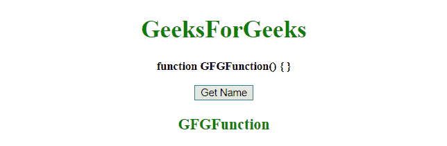

# 如何使用 JavaScript 从该函数内部获取函数名？

> 原文:[https://www . geesforgeks . org/如何使用 javascript 从函数中获取函数名/](https://www.geeksforgeeks.org/how-to-get-the-function-name-from-within-that-function-using-javascript/)

给定一个函数，任务是使用 JavaScript 从函数内部获取函数的名称。

*   **JavaScript String substr() Method:** This method gets parts of a string, starting at the character at the defined position, and returns the specified number of characters.

    **语法:**

    ```
    string.substr(start, length)
    ```

    **参数:**

    *   **开始:**此参数为必填项。它指定开始提取的位置。第一个字符位于索引 0 处。如果 start 为正数并且大于或等于字符串的长度，则此方法返回一个空字符串。如果 start 为负，则此方法从末尾将其用作索引。如果 start 为负或大于字符串长度，start 将用作 0。
    *   **长度:**此参数可选。它指定要提取的字符数。如果不使用，它将提取整个字符串。

    **返回值:**返回一个新的字符串，包含文本的提取部分。如果长度为 0 或负数，则返回空字符串。

*   **Function proptotype name property:** This is a Function object’s read-only name property denoting the function’s name as defined when it was designed, or “anonymous” when created anonymously.

    **语法:**

    ```
    func.name
    ```

    **返回值:**返回函数名。

**示例 1:** 本示例首先使用 **toString()方法**将函数转换为字符串，然后使用 **substr()方法**从该字符串中提取名称。

```
<!DOCTYPE HTML> 
<html> 
    <head> 
        <title> 
            How to get the function name
            from within that function
        </title>
    </head> 

    <body style = "text-align:center;">

        <h1 style = "color:green;" > 
            GeeksForGeeks 
        </h1>

        <p id = "GFG_UP" style = 
            "font-size: 15px; font-weight: bold;">
        </p>

        <button onclick = "GFG_click()">
            Get Name
        </button>

        <p id = "GFG_DOWN" style = 
            "color:green; font-size: 20px; font-weight: bold;">
        </p>

        <script>
            var el_up = document.getElementById("GFG_UP");
            var el_down = document.getElementById("GFG_DOWN");
            el_up.innerHTML = GFGFunction;

            function functionName(fun) {
                var val = fun.toString();
                val = val.substr('function '.length);
                val = val.substr(0, val.indexOf('('));
                el_down.innerHTML = val;
            }
            function GFGFunction() {

            }
            function GFG_click() {
                functionName(GFGFunction);
            }         
        </script> 
    </body> 
</html>                    
```

**输出:**

*   **点击按钮前:**
    
*   **点击按钮后:**
    

**示例 2:** 本示例使用**函数原型名称属性**获取函数的名称。

```
<!DOCTYPE HTML> 
<html> 
    <head> 
        <title> 
            How to get the function name
            from within that function
        </title>
    </head> 

    <body style = "text-align:center;">

        <h1 style = "color:green;" > 
            GeeksForGeeks 
        </h1>

        <p id = "GFG_UP" style = 
            "font-size: 15px; font-weight: bold;">
        </p>

        <button onclick = "GFG_click()">
            Get Name
        </button>

        <p id = "GFG_DOWN" style = 
            "color:green; font-size: 20px; font-weight: bold;">
        </p>

        <script>
            var el_up = document.getElementById("GFG_UP");
            var el_down = document.getElementById("GFG_DOWN");
            el_up.innerHTML = GFGFunction;

            function functionName(fun) {
                var val = fun.name;
                el_down.innerHTML = val;
            }
            function GFGFunction() {

            }
            function GFG_click() {
                functionName(GFGFunction);
            }         
        </script> 
    </body> 
</html>                    
```

**输出:**

*   **点击按钮前:**
    
*   **点击按钮后:**
    