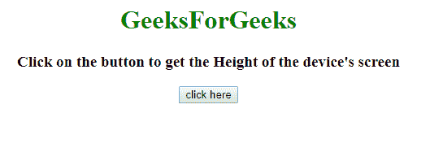
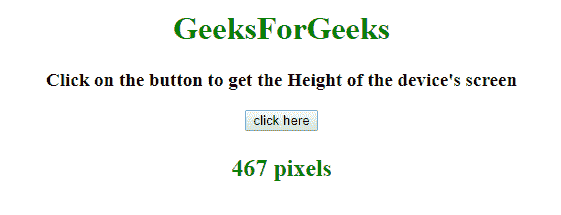

# 如何在 JavaScript 中获取设备屏幕的高度？

> 原文:[https://www . geesforgeks . org/如何在 javascript 中获得设备屏幕高度/](https://www.geeksforgeeks.org/how-to-get-the-height-of-device-screen-in-javascript/)

给定一个运行在设备上的 HTML 文档。任务是使用 JavaScript 找到工作屏幕设备的高度。
先决条件–[如何在 JavaScript 中获取设备屏幕的宽度？](https://www.geeksforgeeks.org/how-to-get-the-device-screhow-to-get-the-width-of-device-screen-in-javascript-en-width-in-javascript/)

**示例 1:** 本示例使用 **window.innerHeight** 属性获取设备屏幕的高度。**内部高度属性**用于返回设备的高度。

```
<!DOCTYPE HTML>
<html>

<head>
    <title>
        How to get the device screen Height in JavaScript ?
    </title>
</head>

<body style="text-align:center;">

    <h1 style="color:green;">  
            GeeksForGeeks 
        </h1>

    <p id="GFG_UP" 
       style="font-size: 19px;
              font-weight: bold;">
    </p>

    <button onclick="GFG_Fun()">
        click here
    </button>

    <p id="GFG_DOWN" 
       style="color: green;
              font-size: 24px;
              font-weight: bold;">
    </p>

    <!-- Script to display the device screen Height -->
    <script>
        var el_up = document.getElementById("GFG_UP");
        var el_down = document.getElementById("GFG_DOWN");

        el_up.innerHTML = 
          "Click on the button to get the" + 
          " Height of the device's screen";

        function GFG_Fun() {
            var Height = window.innerHeight;
            el_down.innerHTML = Height + " pixels";
        }
    </script>
</body>

</html>
```

**输出:**
**点击按钮前:**

**点击按钮后:**


**示例 2:** 本示例使用 document . document element . client Height 方法获取设备屏幕的高度。

```
<!DOCTYPE HTML>
<html>

<head>
    <title>
        How to get the device screen Height in JavaScript ?
    </title>
</head>

<body style="text-align:center;">

    <h1 style="color:green;">  
            GeeksForGeeks 
        </h1>

    <p id="GFG_UP"
       style="font-size: 19px;
              font-weight: bold;">
    </p>

    <button onclick="GFG_Fun()">
        click here
    </button>

    <p id="GFG_DOWN" 
       style="color: green;
              font-size: 24px; 
              font-weight: bold;">
    </p>

    <!-- Script to display the device screen Height -->
    <script>
        var el_up = document.getElementById("GFG_UP");
        var el_down = document.getElementById("GFG_DOWN");

        el_up.innerHTML =
          "Click on the button to get the" +
          " Height of the device's screen";

        function GFG_Fun() {
            el_down.innerHTML =
                document.documentElement.clientHeight + " pixels";
        }
    </script>
</body>

</html>
```

**输出:**
**点击按钮前:**

**点击按钮后:**
