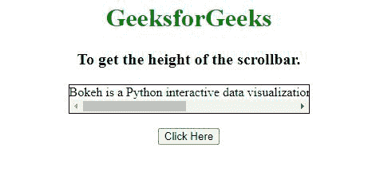
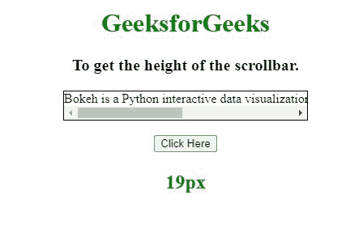
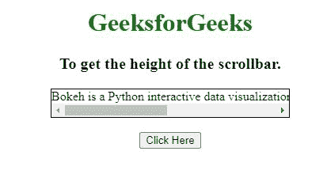
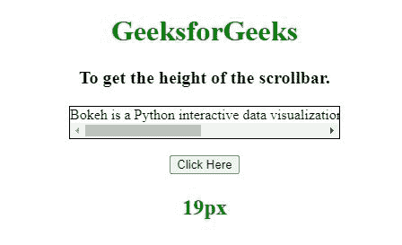

# 如何用 JavaScript 获取滚动条的高度？

> 原文:[https://www . geesforgeks . org/如何使用 javascript 获取滚动条高度/](https://www.geeksforgeeks.org/how-to-get-the-height-of-scroll-bar-using-javascript/)

给定一个 HTML 文档，任务是使用 JavaScript 获取滚动条的高度。下面是解决这个问题的不同方法，将在下面讨论:

**方法 1:** 在这种方法中，创建一个包含滚动条的 div 元素。为了得到滚动条的高度，从 clientHeight of div 中减去 offset of div。

*   偏置高度=元素高度+滚动条高度。
*   ClientHeight =元素的高度。
*   滚动条的高度=偏置高度–客户端高度。

**示例:**该示例实现了上述方法。

## 超文本标记语言

```html
<!DOCTYPE HTML>  
<html>  

<head>  
      <style> 
        h1 { 
            color:green; 
        } 
        #geek1 {  
            width: 300px;  
            overflow-y:hidden; 
            border:1px solid black; 
            white-space: nowrap;
        } 
        #geek2 { 
            font-size: 20px;  
            font-weight: bold; 
        } 
        #geek4 { 
            font-size: 24px;  
            font-weight: bold; 
            color: green; 
        } 
    </style> 
</head>  

<body>  
     <center>
    <h1>GeeksforGeeks</h1> 

    <p id = "geek2"></p> 

    <div id="geek1"> 
        Bokeh is a Python interactive data 
        visualization. It renders its plots
        using HTML and JavaScript. 
    </div> 

    <br> 

    <button onclick = "geek3()"> 
        Click Here 
    </button> 

    <p id = "geek4"></p> 

    <script> 
        var element = document.getElementById('geek1'); 
        var el_up = document.getElementById('geek2'); 
        var el_down = document.getElementById('geek4'); 

        el_up.innerHTML = "To get " 
                    + "the height of the scrollbar."; 

        function geek3() { 
            el_down.innerHTML = element.offsetHeight  
                        - element.clientHeight + "px"; 
        } 
    </script> 
    </center> 
</body>  
</html>
```

**输出:**

**点击按钮前:**



**点击按钮后:**



**方法 2:** 在这种方法中，创建一个外部 div 元素，在这个外部 div 元素中，也创建一个内部 div 元素。为了得到滚动条的高度，从外部 div 中减去内部 div 的高度。

**示例 2:** 该示例实现了上述方法。

## 超文本标记语言

```html
<!DOCTYPE HTML>  
<html>  

<head>  

    <style> 
        h1 { 
            color:green; 
        } 
        #geek1 {  
            width: 300px;  
            overflow-y:hidden; 
            border:1px solid black; 
            white-space: nowrap;
        } 
        #geek2 { 
            font-size: 20px;  
            font-weight: bold; 
        } 
        #geek4 { 
            font-size: 24px;  
            font-weight: bold; 
            color: green; 
        } 
    </style> 
</head>  

<body>  
     <center>
    <h1>GeeksforGeeks</h1> 

    <p id = "geek2"></p> 

    <div id="geek1"> 
        <div id="geek5"> 
            Bokeh is a Python interactive data 
            visualization. It renders its plots
            using HTML and JavaScript. 
        </div>
    </div> 

    <br> 

    <button onclick = "geek3()"> 
        Click Here 
    </button> 

    <p id = "geek4"></p> 

    <script> 
        var element = document.getElementById('geek1'); 
        var el_up = document.getElementById('geek2'); 
        var el_down = document.getElementById('geek4'); 

        el_up.innerHTML = "To get " 
                    + "the height of the scrollbar."; 

        function geek3() { 
            var child = document.querySelector("#geek5"); 
            var scroll = child.parentNode.offsetHeight
                        - child.offsetHeight;
            el_down.innerHTML = scroll + "px"; 
        } 
    </script> 
    </center> 
</body>  
</html>
```

**输出:**

**点击按钮前:**



**点击按钮后:**

