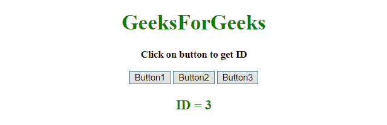
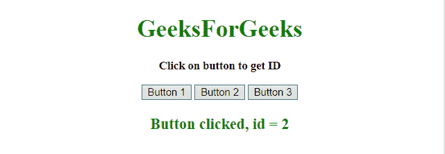

# 如何用 JavaScript / jQuery 获取被点击按钮的 ID？

> 原文:[https://www . geesforgeks . org/如何使用 javascript-jquery/](https://www.geeksforgeeks.org/how-to-get-the-id-of-the-clicked-button-using-javascript-jquery/) 获取被点击按钮的 id

给定一组按钮，任务是使用 JavaScript 和 jQuery 确定按钮被点击时的 ID。

**使用 JavaScript 获取被点击按钮的 ID**

**示例 1:** 本示例为每个按钮设置一个 **onClick 事件**，当按钮被点击时，按钮的 ID 被传递给函数，然后它在屏幕上打印 ID。

```
<!DOCTYPE HTML> 
<html> 
    <head> 
        <title> 
            Get the ID of the clicked button
            using JavaScript
        </title>
    </head> 

    <body style = "text-align:center;"> 

        <h1 style = "color:green;" > 
            GeeksForGeeks 
        </h1>

        <p id = "GFG_UP" style = 
            "font-size: 15px; font-weight: bold;">
        </p>

        <button id="1" onClick="GFG_click(this.id)">
            Button1
        </button>

        <button id="2" onClick="GFG_click(this.id)">
            Button2
        </button>

        <button id="3" onClick="GFG_click(this.id)">
            Button3
        </button>

        <p id = "GFG_DOWN" style = 
            "color:green; font-size: 20px; font-weight: bold;">
        </p>

        <script>
            var el_up = document.getElementById("GFG_UP");
            var el_down = document.getElementById("GFG_DOWN");
            el_up.innerHTML = "Click on button to get ID";

            function GFG_click(clicked) {
                el_down.innerHTML = "ID = "+clicked;
            }         
        </script> 
    </body> 
</html>                    
```

**输出:**

*   **点击按钮前:**
    
*   **点击按钮后:**
    

**示例 2:** 本示例在<脚本>中为每个按钮单独设置一个 **onClick 事件**，当按钮被点击时，按钮的 ID 被传递给函数，然后在屏幕上打印 ID。

```
<!DOCTYPE HTML> 
<html> 
    <head> 
        <title> 
            Get the ID of the clicked button
            in JavaScript
        </title>
    </head> 

    <body style = "text-align:center;"> 

        <h1 style = "color:green;" > 
            GeeksForGeeks 
        </h1>

        <p id = "GFG_UP" style =
            "font-size: 15px; font-weight: bold;">
        </p>

        <button id="1">Button 1</button>
        <button id="2">Button 2</button>
        <button id="3">Button 3</button>

        <p id = "GFG_DOWN" style = 
            "color:green; font-size: 20px; font-weight: bold;">
        </p>

        <script>
            var el_up = document.getElementById("GFG_UP");
            var el_down = document.getElementById("GFG_DOWN");
            el_up.innerHTML = "Click on button to get ID";

            document.getElementById('1').onclick = GFG_click;
            document.getElementById('2').onclick = GFG_click;
            document.getElementById('3').onclick = GFG_click;

            function GFG_click(clicked) {
                el_down.innerHTML = "Button clicked, id = "
                    + this.id;
            }         
        </script> 
    </body> 
</html>                    
```

**输出:**

*   **点击按钮前:**
    
*   **点击按钮后:**
    

**使用 jQuery** 获取被点击按钮的 ID

[**jQuery on()方法:**](https://www.geeksforgeeks.org/jquery-on-with-examples/) 此方法为所选元素和子元素添加一个或多个事件处理程序。

**语法:**

```
$(selector).on(event, childSelector, data, function, map)
```

**参数:**

*   **事件:**此参数为必填项。它指定一个或多个要附加到选定元素的事件或命名空间。如果有多个事件值，这些值用空格隔开。事件必须是有效的。
*   **儿童选择器:**该参数可选。它指定事件处理程序应该只附加到已定义的子元素。
*   **数据:**此参数为可选。它指定要传递给函数的附加数据。
*   **功能:**此参数为必选项。它指定事件发生时要运行的函数。
*   **映射:**它指定了一个事件映射({event:func()，event:func()，…})，该事件映射有一个或多个要添加到所选元素的事件，以及事件发生时要运行的函数。

[**jQuery click()方法:**](https://www.geeksforgeeks.org/jquery-click-with-examples/) 该方法触发点击事件，或者添加一个函数，在点击事件发生时运行。单击元素时会发生 Click 事件。

**语法:**

*   **触发所选元素的点击事件:**

    ```
    $(selector).click()
    ```

*   **为点击事件添加功能:**

    ```
    $(selector).click(function)
    ```

**参数:**该方法接受单参数**功能**，可选。它指定单击事件发生时要运行的函数。

**示例 1:** 本示例通过使用 **click()方法**为每个按钮设置一个 **onClick 事件**，当按钮被点击时，按钮的 ID 被传递给函数，然后在屏幕上打印该 ID。

```
<!DOCTYPE HTML> 
<html> 
    <head> 
        <title> 
            Get the ID of the clicked button
            using jQuery
        </title>

        <script src =
"https://ajax.googleapis.com/ajax/libs/jquery/3.4.0/jquery.min.js">
        </script>
    </head> 

    <body style = "text-align:center;"> 

        <h1 style = "color:green;" > 
            GeeksForGeeks 
        </h1>

        <p id = "GFG_UP" style = 
            "font-size: 15px; font-weight: bold;">
        </p>

        <button id="1"> Button1</button>
        <button id="2"> Button2</button>
        <button id="3"> Button3</button>

        <p id = "GFG_DOWN" style = 
            "color:green; font-size: 20px; font-weight: bold;">
        </p>

        <script>
            $('#GFG_UP').text("Click on button to get ID");

            $("button").click(function() {
                var t = $(this).attr('id');
                $('#GFG_DOWN').text("ID = " + t);
            });                     
        </script> 
    </body> 
</html>                    
```

**输出:**

*   **点击按钮前:**
    
*   **点击按钮后:**
    

**示例 2:** 本示例通过使用 **on()方法**为每个按钮设置一个 **onClick 事件**，当按钮被点击时，按钮的 ID 被传递给函数，然后在屏幕上打印该 ID。

```
<!DOCTYPE HTML> 
<html> 
    <head> 
        <title> 
            Get the ID of the clicked button
            using jQuery
        </title>

        <script src = 
"https://ajax.googleapis.com/ajax/libs/jquery/3.4.0/jquery.min.js">
        </script>
    </head> 

    <body style = "text-align:center;">

        <h1 style = "color:green;" > 
            GeeksForGeeks 
        </h1>

        <p id = "GFG_UP" style = 
            "font-size: 15px; font-weight: bold;">
        </p>

        <button id="1"> Button1</button>
        <button id="2"> Button2</button>
        <button id="3"> Button3</button>

        <p id = "GFG_DOWN" style = 
            "color:green; font-size: 20px; font-weight: bold;">
        </p>

        <script>
            $('#GFG_UP').text("Click on button to get ID");

            $("button").on('click',function() {
                var t = (this.id);
                $('#GFG_DOWN').text("ID = " + t);
            });                     
        </script> 
    </body> 
</html>                    
```

**输出:**

*   **点击按钮前:**
    
*   **点击按钮后:**
    

jQuery 是一个开源的 JavaScript 库，它简化了 HTML/CSS 文档之间的交互，它以其“少写多做”的理念而闻名。
跟随本 [jQuery 教程](https://www.geeksforgeeks.org/jquery-tutorials/)和 [jQuery 示例](https://www.geeksforgeeks.org/jquery-examples/)可以从头开始学习 jQuery。