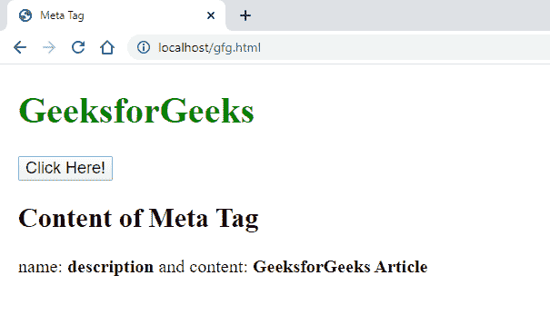

# 如何使用 JavaScript 从元标签中获取信息？

> 原文:[https://www . geesforgeks . org/如何使用 javascript 从元标签获取信息/](https://www.geeksforgeeks.org/how-to-get-the-information-from-a-meta-tag-using-javascript/)

为了用 JavaScript 在 HTML 中显示元标签信息，我们将使用一个名为 [getElementByTagName()](https://www.geeksforgeeks.org/html-dom-getelementsbytagname-method/) 函数的方法。

**方法 1:** 使用 **getElementsByTagName()** 方法。

**语法:**

```html
document.getElementsByTagName("meta");
```

这样，我们就可以从一个 HTML 文件中获取所有的元元素。当我们点击按钮时，所有的元标签名称和内容都会显示在网页上。

**例 1:**

```html
<!DOCTYPE html>
<html>

<head>
    <meta name="description" 
          content="GeeksforGeeks Article">
    <meta name="keywords" 
          content="GeeksforGeeks,GfG,Article">
    <meta name="author" 
          content="Aakash Pawar">
    <title>GfG</title>
    <style>
        body {
            font-size: 20px;
            margin: 20px;
        }

        button {
            font-size: 18px;
        }
    </style>
</head>

<body>
    <button onclick="GfGFunction()">
      Click Here!
  </button>
  <br>
    <div id="demo">
        <h2>Content of Meta Tag<h2></div>
    <script>
        function GfGFunction() {
          var meta = document.getElementsByTagName("meta");
          for (var i = 0; i < 3; i++) {
            document.getElementById("demo").innerHTML +=
              "name: <b>"+meta[i].name+"</b> and content: <b>"
            +meta[i].content+"</b><br>";
          }
        }
    </script>
</body>
</html>
```

**输出:**


**方法二:**使用 **getElementsByTagName()** 方法，带指标说明。

**语法:**

```html
var meta = document.getElementsByTagName("meta")[0];
```

这里，索引号“ **0** ”代表第一个元元素。您可以将 HTML 文件中的所有元元素视为一个数组，并可以通过指定元标签的索引来访问它们。这样，我们可以从一个 HTML 文件中获取特定的元元素。

**例 2:**

```html
<!DOCTYPE html>
<html>

<head>
    <meta id="author" 
          name="description" 
          content="GeeksforGeeks Article">
    <meta id="author" 
          name="keywords" 
          content="GeeksforGeeks,GfG,Article">
    <meta id="author" 
          name="author" 
          content="Aakash Pawar">
    <title>Meta Tag</title>
    <style>
        body {
            font-size: 20px;
            margin: 20px;
        }

        button {
            font-size: 18px;
        }

        h1 {
            color: green;
        }
    </style>
</head>

<body>
    <h1>GeeksforGeeks</h1>
    <button onclick="GfGFunction()">Click Here!</button>
    <br>
    <div id="demo">
        <h2>Content of Meta Tag<h2></div>
    <script>
        function GfGFunction() {
          var meta = document.getElementsByTagName("meta")[0];
          document.getElementById("demo").innerHTML +=  
            "name: <b>"+meta.name+"</b> and content: <b>"
          +meta.content+"</b><br>";
        }
    </script>
</body>
</html>
```

**输出:**
