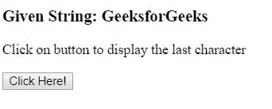
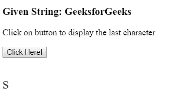

# 如何在 JavaScript 中获取字符串的最后一个字符？

> 原文:[https://www . geesforgeks . org/如何获取 javascript 字符串中的最后一个字符/](https://www.geeksforgeeks.org/how-to-get-the-last-character-of-a-string-in-javascript/)

给定一个大小为 **len** 的字符串，任务是获取字符串的最后一个字符。有许多方法可以解决这个问题，下面讨论其中一些:

**方法 1:使用 [charAt()函数](https://www.geeksforgeeks.org/javascript-string-charat/) :** 该函数返回给定索引处的字符。

**语法:**

```
character = str.charAt(index)
```

首先使用**字符串长度**函数计算给定字符串中的字符数。因为索引从 0 开始，所以使用**字符串字符(字符串长度-1)** 来获取字符串的最后一个字符。

**示例:**

```
<!DOCTYPE html>
<html>

<head>
    <title>
        Get the last character
        of a string
    </title>
</head>

<body>
    <h3>Given String: GeeksforGeeks</h3>

    <p>
        Click on button to display the
        last character
    </p>

    <button onclick="myGeeks()">
        Click Here!
    </button>

    <p id="GFG" style="font-size:30px; color:green;"></p>

    <!-- Script to return the last character of string -->
    <script>
        function myGeeks() {
            var str = "GeeksforGeeks";
            var res = str.charAt(str.length-1);

            document.getElementById("GFG").innerHTML
                    = res;
        }
    </script>
</body>

</html>                    
```

**输出:**

*   **点击按钮前:**
    
*   **点击按钮后:**
    

**方法二:使用 [str.slice()函数](https://www.geeksforgeeks.org/javascript-string-slice/):**string . slice()函数用于返回给定输入字符串的一部分或切片。

**语法:**

```
str.slice(startingindex, endingindex)
```

**示例:**本示例使用 slice()函数获取字符串的最后一个字符。

```
<!DOCTYPE html>
<html>

<head>
    <title>
        Get the last character
        of a string
    </title>
</head>

<body>
    <h3>Given String: GeeksforGeeks</h3>

    <p>
        Click on button to display the
        last character
    </p>

    <button onclick="myGeeks()">
        Click Here!
    </button>

    <p id="GFG" style="font-size:30px; color:green;"></p>

    <!-- Script to return the last character of string -->
    <script>
        function myGeeks() {
            var str = "GeeksforGeeks";
            var res = str.slice(-1);

            document.getElementById("GFG").innerHTML
                    = res;
        }
    </script>
</body>

</html>                    
```

**输出:**

*   **点击按钮前:**
    
*   **点击按钮后:**
    