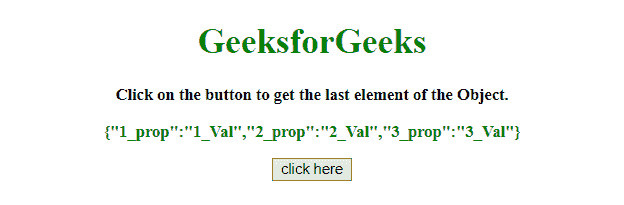
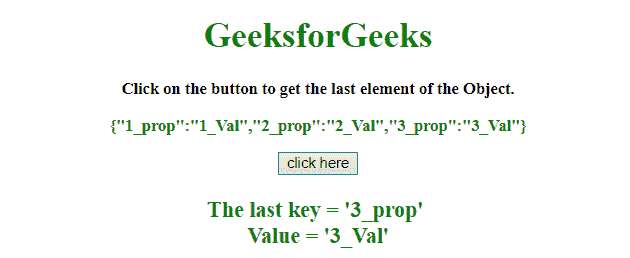

# 如何获取 JavaScript 对象的最后一项？

> 原文:[https://www . geesforgeks . org/如何获取最后一项 javascript 对象/](https://www.geeksforgeeks.org/how-to-get-the-last-item-of-javascript-object/)

给定一个 JavaScript 对象，任务是获取 JavaScript 对象的最后一个元素。

**方法 1:**

*   使用 **Object.keys()方法**获取对象的所有键。
*   现在使用索引来访问 JavaScript 对象的最后一个元素。

**示例:**该示例实现了上述方法。

```
<!DOCTYPE HTML> 
<html> 

<head> 
    <title> 
        How to get the last item
        of JavaScript object ?
    </title>     
</head> 

<body style = "text-align:center;"> 

    <h1 style = "color:green;" > 
        GeeksforGeeks 
    </h1> 

    <p id = "GFG_UP1" style = 
        "font-size: 15px; font-weight: bold;"> 
    </p> 

    <p id = "GFG_UP2" style = "font-size: 15px;
            font-weight: bold; color: green;"> 
    </p> 

    <button onclick = "GFG_Fun()"> 
        click here 
    </button> 

    <p id = "GFG_DOWN" style = "color:green;
        font-size: 20px; font-weight: bold;"> 
    </p>

    <script> 
        var up1 = document.getElementById('GFG_UP1'); 
        var up2 = document.getElementById('GFG_UP2'); 
        var down = document.getElementById('GFG_DOWN'); 

        var Obj = { 
            "1_prop": "1_Val", 
            "2_prop": "2_Val", 
            "3_prop": "3_Val" 
        }; 

        up1.innerHTML = "Click on the button to get"
                + "the last element of the Object."; 

        up2.innerHTML = JSON.stringify(Obj); 

        function GFG_Fun() { 
            down.innerHTML = "The last key = '" + 
                Object.keys(Obj)[Object.keys(Obj).length-1]
                + "' <br> Value = '" 
                + Obj[Object.keys(Obj)[Object.keys(Obj).length-1]]
                + "'"; 
        } 
    </script> 
</body> 

</html>
```

**输出:**

*   **点击按钮前:**
    
*   **点击按钮后:**
    

**方法 2:**

*   使用**进行循环**访问对象的所有键，在循环结束时，循环变量将拥有对象的最后一个键。
*   现在使用索引来访问 JavaScript 对象的最后一个元素的值。

**示例:**该示例实现了上述方法。

```
<!DOCTYPE HTML> 
<html> 

<head> 
    <title> 
        How to get the last item
        of JavaScript object ?
    </title>     
</head> 

<body style = "text-align:center;"> 

    <h1 style = "color:green;" > 
        GeeksforGeeks 
    </h1> 

    <p id = "GFG_UP1" style = 
        "font-size: 15px; font-weight: bold;"> 
    </p> 

    <p id = "GFG_UP2" style = "font-size: 15px;
        font-weight: bold; color: green;"> 
    </p>

    <button onclick = "GFG_Fun()"> 
        click here 
    </button> 

    <p id = "GFG_DOWN" style = "color:green;
        font-size: 20px; font-weight: bold;"> 
    </p>

    <script> 
        var up1 = document.getElementById('GFG_UP1'); 
        var up2 = document.getElementById('GFG_UP2'); 
        var down = document.getElementById('GFG_DOWN'); 

        var Obj = { 
            "1_prop": "1_Val", 
            "2_prop": "2_Val", 
            "3_prop": "3_Val" 
        }; 

        up1.innerHTML = "Click on the button to get"
                + "the last element of the Object."; 

        up2.innerHTML = JSON.stringify(Obj); 

        function GFG_Fun() {
            var lastElement;

            for (lastElement in Obj);
                lastElement;

            down.innerHTML = "The last key = '" + 
                lastElement + "' <br> Value = '" 
                + Obj[lastElement] + "'"; 
        } 
    </script> 
</body> 

</html>
```

**输出:**

*   **点击按钮前:**
    
*   **点击按钮后:**
    