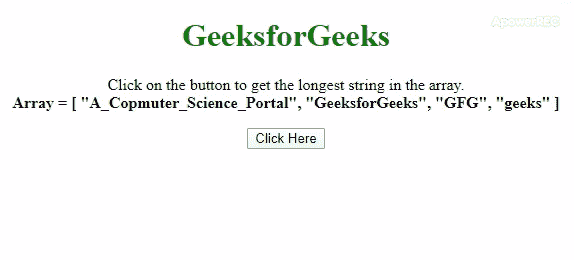

# 如何用 JavaScript 获取数组中最长的字符串？

> 原文:[https://www . geesforgeks . org/如何使用 javascript 获取最长的数组字符串/](https://www.geeksforgeeks.org/how-to-get-the-longest-string-in-an-array-using-javascript/)

任务是从数组中获取最长的字符串。这里讨论了一些在 JavaScript 帮助下最常用的技术。在本文中，我们将使用两个 JavaScript 方法 [**sort()** 方法](https://www.geeksforgeeks.org/javascript-sort-method/)和[T5【reduce()方法](https://www.geeksforgeeks.org/javascript-array-reduce-method/)来找出数组中最长的字符串。这两种方法都将在下面用示例进行描述。

**方法 1:** 在这种方法中，我们将使用**。sort()方法**在数组的每 2 个元素上调用一个函数。它接受“a”和“b”两个参数，并比较它们的长度。如果答案是肯定的，那么“b”更大，否则“a”更大。这个方法按照元素长度递减的顺序排列元素，我们可以通过[0]访问第一个元素。

*   **示例:**该示例实现了上述方法。

    ```
    <!DOCTYPE HTML>
    <html>

    <head>
        <title>
            How to get the longest string
            in an array using JavaScript ?
        </title>

        <style>
            body {
                text-align: center;
            }
            h1 {
                color: green;
            }
            #geeks{
                font-weight: bold;
            }
        </style>
    </head>

    <body>
        <h1>GeeksforGeeks</h1>

        <p>
            Click on the button to get the
            longest string in the array.<br>
            <b>Array = [
                    "A_Copmuter_Science_Portal", 
                    "GeeksforGeeks", 
                    "GFG", 
                    "geeks"
                ]
            </b>
        </p>

        <button onclick="gfg_Run()">
            Click Here
        </button>

        <p id="geeks"></p>

        <script>
            var el_down = document.getElementById("geeks");

            var arr = [
                "A_Copmuter_Science_Portal", 
                "GeeksforGeeks",
                "GFG", 
                "geeks"
            ];

            // It compares the length of an element with
            // every other element and after sorting
            // them in decreasing order it returns the
            // first element.
            function gfg_Run() {
                el_down.innerHTML = "'" + 
                        arr.sort(function(a, b) {
                    return b.length - a.length;
                })[0] + "' is the longest string"
                        + " in the array.";
            }
        </script>
    </body>

    </html>
    ```

*   **输出:**
    

**方法 2:** 在这种方法中，我们将使用**。reduce()方法**在数组的每 2 个元素上调用一个函数。它接受“a”和“b”两个参数，并比较它们的长度。它返回长度大于每个元素的元素。

*   **示例:**该示例实现了上述方法。

    ```
    <!DOCTYPE HTML>
    <html>

    <head>
        <title>
            How to get the longest string
            in an array using JavaScript ?
        </title>

        <style>
            body {
                text-align: center;
            }
            h1 {
                color: green;
            }
            #geeks{
                font-weight: bold;
            }
        </style>
    </head>

    <body>
        <h1>GeeksforGeeks</h1>

        <p>
            Click on the button to get the
            longest string in the array.<br>
            <b>Array = [
                "A_Copmuter_Science_Portal", 
                "GeeksforGeeks", 
                "GFG", 
                "geeks"
                ]
            </b>
        </p>

        <button onclick="gfg_Run()">
            Click Here
        </button>

        <p id="geeks"></p>

        <script>
            var el_down = document.getElementById("geeks");

            var arr = [
                "A_Copmuter_Science_Portal", 
                "GeeksforGeeks",
                "GFG", 
                "geeks"
            ];

            // It compares the length of a element with
            // every other element and return it if its
            // greater than every other element.
            function gfg_Run() {
                    el_down.innerHTML = "'" + 
                    arr.reduce(function (a, b) { 
                        return a.length > b.length ? a : b; 
                    }) + "' is the longest string"
                        + " in the array."; 
                }
        </script>
    </body>

    </html>
    ```

*   **输出:**
    