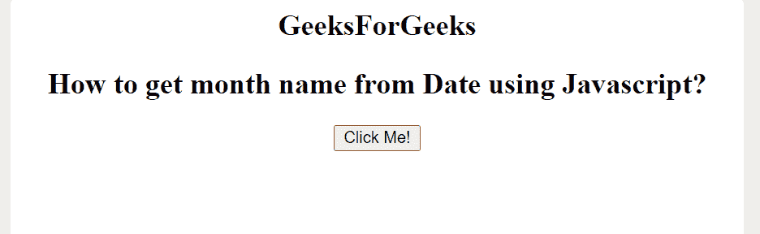
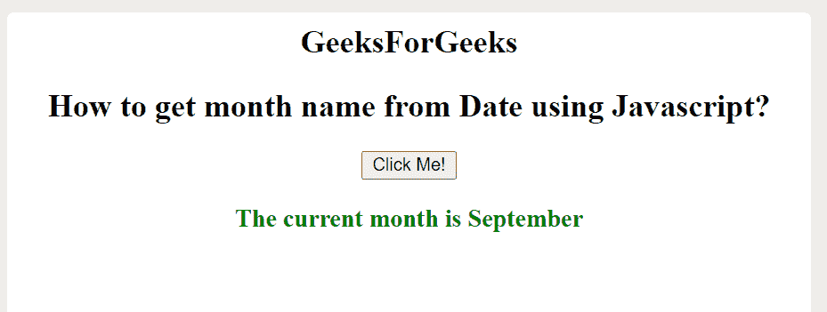

# 如何用 JavaScript 从 Date 获取月份名称？

> 原文:[https://www . geeksforgeeks . org/如何使用 javascript 从日期开始获取月份名称/](https://www.geeksforgeeks.org/how-to-get-the-month-name-from-date-using-javascript/)

本文的目的是使用 JavaScript **getMonth()** 方法获取特定日期的月份名称。该方法用于从给定的**日期**对象中获取月份(0 到 11)。它返回一个整数值，范围从(0 到 11)零(0)表示一月，1 表示二月，依此类推，直到 11 表示十二月。

**语法:**

```html
DateObj.getMonth()
```

**示例:**下面的代码用于显示属于特定日期的当前月份。

## 超文本标记语言

```html
<!DOCTYPE html>
<html>

<body style="text-align:center;">
    <h2>
        GeeksForGeeks
    </h2>
    <h2>
        How to get month name from 
        Date using Javascript?
    </h2>

    <button onclick="myFunction()">
        Click Me!
    </button>

    <h3 id="demoID" style="color:green;">
    </h3>

    <script>
        function myFunction() {
            // initializing an array 
            const months = [
                "January", "February", 
                "March", "April", "May", 
                "June", "July", "August",
                "September", "October", 
                "November", "December"
            ];

            const d = new Date();
            document.getElementById(
                "demoID").innerHTML =
                "The current month is " 
                + months[d.getMonth()];
        }
    </script>
</body>

</html>
```

**Output:**

*   **点击按钮前:**

    

*   **点击按钮后:**

    

**支持的浏览器:**

*   谷歌 Chrome
*   微软公司出品的 web 浏览器
*   火狐浏览器
*   歌剧
*   旅行队