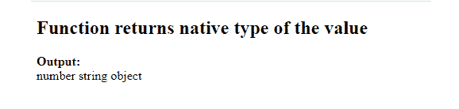

# 如何在 JavaScript 中获取一个值的原生类型？

> 原文:[https://www . geeksforgeeks . org/如何在 javascript 中获取本机类型的值/](https://www.geeksforgeeks.org/how-to-get-the-native-type-of-a-value-in-javascript/)

JavaScript 变量可以存储任何类型的值。可以使用 运算符的 JavaScript *[类型来找出值的原生类型。](https://www.geeksforgeeks.org/javascript-typeof-operator/)*

它返回一个指示值类型的字符串值。

**语法:**

```
typeof(value)
```

**示例:**

## 超文本标记语言

```
<!DOCTYPE html>
<html>
  <body>
    <h2>Function returns native type of the value</h2>
    <strong>Output: </strong><br />
    <div id="output"></div>
    <script>
      document.getElementById("output").innerHTML =
        typeof 98 + " " + typeof "geeksforgeeks" + " " + typeof null;
    </script>
  </body>
</html>
```

**输出:**



**可能的输出值** ***类型:***

<figure class="table">

| **Type** | **Result** |
| is not defined. | [undefined] |
| *is invalid* | [object] |
| [Symbol] |
| *Function* | [Function] |
| *Object* | [object] |

</figure>