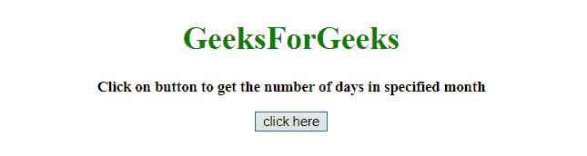
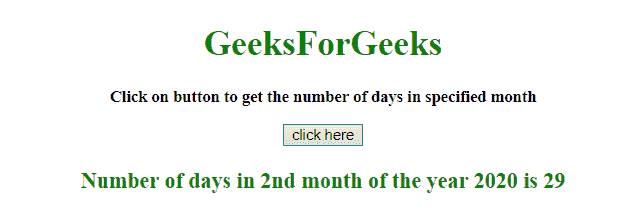
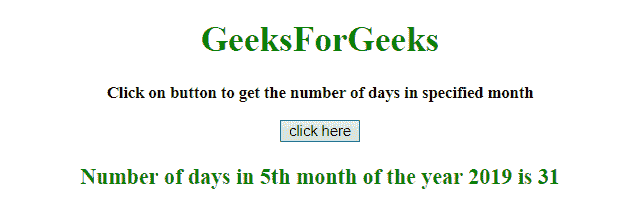

# 如何用 JavaScript 获取指定月份的天数？

> 原文:[https://www . geesforgeks . org/如何使用 javascript 获取指定月份的天数/](https://www.geeksforgeeks.org/how-to-get-the-number-of-days-in-a-specified-month-using-javascript/)

给定一个月，任务是使用 JavaScript 确定该月的天数。

*   **JavaScript getDate() Method:** This method returns the number of days in a month (from 1 to 31) for the defined date.

    **语法:**

    ```
    Date.getDate()
    ```

    **返回值:**返回一个数字，从 1 到 31，代表一个月中的某一天。

*   **JavaScript getFullYear() Method:** This method returns the year (four digits for dates between year 1000 and 9999) of the defined date.

    **语法:**

    ```
    Date.getFullYear()
    ```

    **返回值:**返回一个数字，代表定义日期的年份

*   **JavaScript getMonth() Method:** This method returns the month (from 0 to 11) for the defined date, based on to local time.

    **语法:**

    ```
    Date.getMonth()
    ```

    **返回值:**返回一个数字，从 0 到 11，代表月份。

**示例 1:** 本示例通过将月份(1-12)和年份传递给函数 daysInMonth 来获取一年(2020 年)的月份(2 月)中的天数。

```
<!DOCTYPE HTML> 
<html> 
    <head> 
        <title> 
            Get number of days in
            a specified month
        </title>     
    </head> 

    <body style = "text-align:center;">

        <h1 style = "color:green;" > 
            GeeksForGeeks 
        </h1>

        <p id = "GFG_UP" style =
            "font-size: 15px; font-weight: bold;">
        </p>

        <button onclick = "GFG_Fun()">
            click here
        </button>

        <p id = "GFG_DOWN" style =
            "color:green; font-size: 20px; font-weight: bold;">
        </p>

        <script>
            var up = document.getElementById('GFG_UP');

            up.innerHTML = "Click on button to get the"
                + " number of days in specified month";

            var down = document.getElementById('GFG_DOWN'); 

            function daysInMonth (month, year) {
                return new Date(year, month, 0).getDate();
            }

            function GFG_Fun() {
                var date = new Date();
                var month = 2;
                var year = 2020;
                down.innerHTML = "Number of days in " + month
                             + "nd month of the year " + year
                             +" is "+ daysInMonth(month, year);
            }
        </script> 
    </body> 
</html>                    
```

**输出:**

*   **点击按钮前:**
    
*   **点击按钮后:**
    

**示例 2:** 本示例通过将月份(1-12)和年份传递给函数 daysInMonth 来获取当年当月的天数。

```
<!DOCTYPE HTML> 
<html> 
    <head> 
        <title> 
            Get number of days in a specified month
        </title>     
    </head> 

    <body style = "text-align:center;"> 

        <h1 style = "color:green;" > 
            GeeksForGeeks 
        </h1>

        <p id = "GFG_UP" style = 
            "font-size: 15px; font-weight: bold;">
        </p>

        <button onclick = "GFG_Fun()">
            click here
        </button>

        <p id = "GFG_DOWN" style = 
            "color:green; font-size: 20px; font-weight: bold;">
        </p>

        <script>
            var up = document.getElementById('GFG_UP');

            up.innerHTML = "Click on button to get the number"
                    + " of days in specified month";

            var down = document.getElementById('GFG_DOWN'); 

            function daysInMonth (month, year) {
                return new Date(year, month, 0).getDate();
            }

            function GFG_Fun() {
                var date = new Date();
                var month = date.getMonth() + 1;
                var year = date.getFullYear();
                down.innerHTML = "Number of days in " + month
                            + "th month of the year " + year 
                            +" is "+ daysInMonth(month, year);
            }
        </script> 
    </body> 
</html>                    
```

**输出:**

*   **点击按钮前:**
    
*   **点击按钮后:**
    