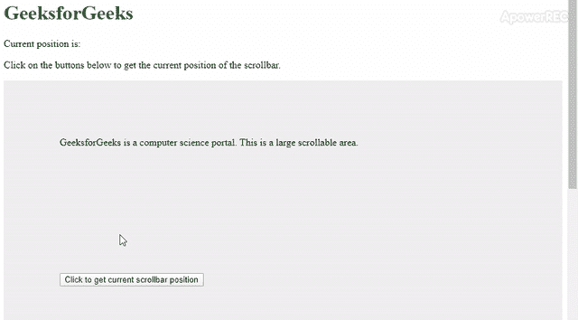
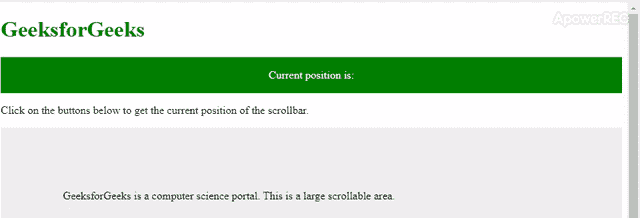

# 如何用 JavaScript 获取滚动条的位置？

> 原文:[https://www . geeksforgeeks . org/如何使用 javascript 获取滚动条位置/](https://www.geeksforgeeks.org/how-to-get-the-position-of-scrollbar-using-javascript/)

javascript 是一种令人惊叹的语言，有许多可用的功能，通过它我们可以通过 JavaScript 访问 HTML 页面的任何元素。下面讨论一些获取滚动条位置的简单技术:

**方法 1:** 每当遇到函数 **getScroll()** 时，它将滚动条的当前值设置到其 **id** 为**位置**的 span 元素。滚动条沿水平和垂直轴的位置用整数表示。pageXOffset 属性返回沿水平轴(即左和右)滚动的像素数，pageYOffset 属性返回沿垂直轴(即上和下)滚动的像素数。pageXOffset 和 pageYOffset 属性等于 scrollX 和 scrollY 属性，并且是只读属性。

*   **程序:**

    ```
    <!DOCTYPE html>
    <html>

    <head>
        <title>
            Scrollbar position using JavaScript/jQuery?
        </title>
        <style>
            .scroll-area {
                height: 1000px;
                background-color: #eee;
                padding: 10%;
            }

            button {
                margin-top: 200px;
                margin-bottom: 100px;
                display: block;
            }
        </style>
    </head>

    <body>
        <h1 style="color: green"> 
           GeeksforGeeks 
        </h1>
        <div>
            <p>Current position is:
              <b><span id="position"></span></b>
            </p>
        </div>
        <p>
          Click on the buttons below to get the current
          position of the scrollbar.
        </p>

        <p class="scroll-area">
          GeeksforGeeks is a computer science portal. 
          This is a large scrollable area.

            <button onclick="getScroll()"> 
              Click to get current scrollbar position
            </button>
            <button onclick="getScroll()"> 
              Click to get current scrollbar position 
            </button>
            <button onclick="getScroll()"> 
              Click to get current scrollbar position 
            </button>
        </p>

        <script>
            getScroll = () => {
                var position = document.getElementById('position');
                position.innerHTML = ""
                if (window.pageYOffset != undefined) {
                    position.innerHTML = " X-axis : " 
                    + pageXOffset + " Y-axis : " + pageYOffset;
                } else {
                    var x_axis, y_axis, doc = document,
                        ele = doc.documentElement,
                        b = doc.body;
                    x_axis = ele.scrollLeft || b.scrollLeft || 0;
                    y_axis = ele.scrollTop || b.scrollTop || 0;
                    position.innerHTML = " X-axis : "
                    + x_axis + " Y-axis : " + y_axis;
                }
            }
        </script>
    </body>

    </html>
    ```

*   **输出:** 

**方法 2:** 使用事件监听器定位滚动条。窗口界面代表一个包含 DOM 文档的窗口，我们可以通过在它上面添加一个事件监听器来获得滚动条的位置。每当滚动事件触发时，该功能将自动触发。scrollX 和 scrollY 返回浮点值。每当滚动事件发生时，事件侦听器将自动触发并更新 id 为位置的元素中滚动条位置的值。

*   **程序:**

    ```
    <!DOCTYPE html>
    <html>

    <head>
        <title>
            Scrollbar position using JavaScript/jQuery?
        </title>
        <style>
            .scroll-area {
                height: 1000px;
                background-color: #eee;
                padding: 10%;
            }

            #sticky {
                position: sticky;
                top: 0;
                background: #008000;
                color: white;
                padding: 1px;
                text-align: center;
            }
        </style>
    </head>

    <body>
        <h1 style="color: green">
          GeeksforGeeks 
        </h1>

        <div id="sticky">
            <p>Current position is:
              <b><span id="position"></span></b>
            </p>
        </div>
        <p>
          Click on the buttons below to get the 
          current position of the scrollbar.
        </p>

        <p class="scroll-area">
          GeeksforGeeks is a computer science portal.
          This is a large scrollable area.
        </p>
        <script>
            var position = document.getElementById('position');
            position.innerHTML = ""

            window.addEventListener("scroll", function(event) {

                var scroll_y = this.scrollY;
                var scroll_x = this.scrollX;
                console.log(scroll_x, scroll_y);
                position.innerHTML = " X-axis : " 
                + scroll_x + "Y-axis : " + scroll_y
            });
        </script>
    </body>

    </html>
    ```

*   **输出:** 