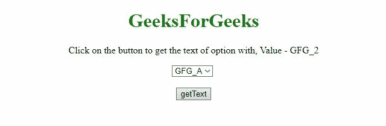
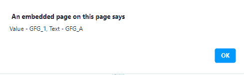
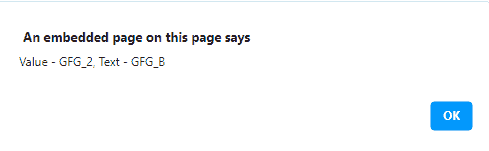
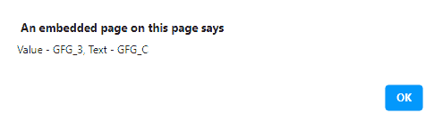

# 如何用 JavaScript 通过值获取选项标签的文本？

> 原文:[https://www . geesforgeks . org/如何使用 javascript 按值获取选项标签文本/](https://www.geeksforgeeks.org/how-to-get-the-text-of-option-tag-by-value-using-javascript/)

包含一些选项元素的 HTML 文档，任务是在 JavaScript 的帮助下，通过使用其值来获取 select 元素的选项文本。下面讨论两种方法:
**方法 1:** 首先，通过 JavaScript 选择器选择选项，使用 [**值属性**](https://www.geeksforgeeks.org/html-dom-value-property/) (如选项[i]。值)来比较选项元素的值。如果匹配，则使用 [**文本属性**](https://www.geeksforgeeks.org/html-dom-option-text-property/) (例如选项[i]。text)获取选项元素的文本。

**例:**

## 超文本标记语言

```html
<!DOCTYPE html>
<html>

<head>
    <title>
        Get text of option tag by
        value using pure JavaScript
    </title>
</head>

<body style="text-align:center;">

    <h1 style="color:green;">
        GeeksForGeeks
    </h1>

    <p id="GFG_UP"></p>

    <select id='GFG_list'>
        <option value='GFG_1'>GFG_A</option>
        <option value='GFG_2'>GFG_B</option>
        <option value='GFG_3'>GFG_C</option>
    </select>

    <br><br>

    <button id="GFG_Button" onclick="getText()">
        getText
    </button>

    <p id="GFG_P"></p>

    <script>
        var el = document.getElementById("GFG_P");
        var up = document.getElementById("GFG_UP");
        var val = "GFG_2";

        up.innerHTML = "Click on the button to get "
            + "the text of option with, Value - " + val;

        function getText() {
            var a = document.getElementById("GFG_list");
            for (var i = 0; i < a.length; i++) {
                var option = a.options[i];
                if (option.value == val) {
                    el.innerHTML = option.text;
                }
            }
        }
    </script>
</body>

</html>
```

**输出:**



**方法 2:** 在这个例子中，我们可以查找每个选项元素，并匹配元素的特定值。我们使用 [**Object.values()方法**](https://www.geeksforgeeks.org/object-values-javascript/) 来获取选项元素的值。然后在每个选项上应用 [**forEach()方法**](https://www.geeksforgeeks.org/javascript-array-foreach/) ，并提醒值及其文本。

**例:**

## 超文本标记语言

```html
<!DOCTYPE html>
<html>

<head>
    <title>
        Get text of option tag by
        value using pure JavaScript
    </title>
</head>

<body style="text-align:center;">

    <h1 style="color:green;">
        GeeksForGeeks
    </h1>

    <p id="GFG_UP"></p>

    <select id='GFG_list'>
        <option value='GFG_1'>GFG_A</option>
        <option value='GFG_2'>GFG_B</option>
        <option value='GFG_3'>GFG_C</option>
    </select>
    <br><br>

    <button id="GFG_Button" onclick="getText()">
        getText
    </button>

    <script>
        var up = document.getElementById("GFG_UP");
        up.innerHTML = "Click on the button to "
                    + "get the text of options";

        function getText() {
            Object.values(document.getElementById(
                'GFG_list').options).
                forEach(function (option) {
                    alert("Value - " + option.value
                         + ", Text - " + option.text);
                });
        }
    </script>
</body>

</html>
```

**输出:**





