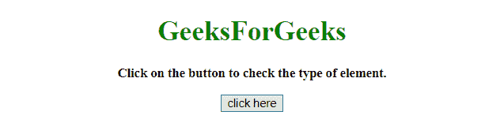
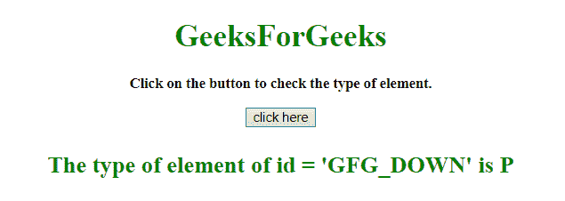
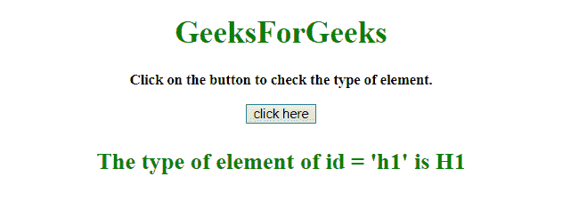

# 如何用 JavaScript 获取 DOM 元素的类型？

> 原文:[https://www . geesforgeks . org/如何使用 javascript 获取 dom 元素类型/](https://www.geeksforgeeks.org/how-to-get-the-type-of-dom-element-using-javascript/)

任务是通过对象引用获取 DOM 元素的类型。这里我们将使用 JavaScript 来解决这个问题。
**进场 1:**

*   首先获取 DOM 对象对变量的引用(这里，在这个例子中，数组由元素的标识组成，然后选择随机标识并选择那个特定的元素)。
*   使用**。标记名属性**获取元素名称。

**实施例 1:** 该实施例使用上述方法。

```
<!DOCTYPE HTML>
<html>

<head>
    <title>
        How to get the type of DOM 
      element using JavaScript?
    </title>
</head>
<center>

    <body style="text-align:center;">
        <h1 id="h1" style="color:green;">  
        GeeksForGeeks  
    </h1>
        <p id="GFG_UP" 
           style="font-size: 15px;
                  font-weight: bold;">
        </p>
        <button id="button" onclick="GFG_Fun()">
            click here
        </button>
        <p id="GFG_DOWN" 
           style="font-size: 24px; 
                  font-weight: bold; 
                  color: green;">
        </p>
        <script>
            var up = document.getElementById('GFG_UP');
            var down = document.getElementById('GFG_DOWN');
            var arr = ["h1", "GFG_UP", "button", "GFG_DOWN"];
            up.innerHTML =
              "Click on the button to check the type of element.";

            function GFG_Fun() {
                var id = arr[Math.floor(Math.random() * arr.length)];
                down.innerHTML = 
                  "The type of element of id = '" + id + "' is " 
                + document.getElementById(id).tagName;
            }
        </script>
    </body>
</center>

</html>
```

**输出:**

*   **点击按钮前:**
    
*   **点击按钮后:**
    

**方法 2:**

*   首先获取 DOM 对象对变量的引用(这里，在这个例子中，数组是由元素的标识组成的，然后从数组中选择随机标识并选择那个特定的元素)。
*   使用**。nodeName 属性**获取元素名称。

**示例 2:** 该示例使用上述方法。

```
<!DOCTYPE HTML>
<html>

<head>
    <title>
        How to get the type of 
      DOM element using JavaScript?
    </title>
</head>
<center>

    <body style="text-align:center;">
        <h1 id="h1" style="color:green;">  
        GeeksForGeeks  
    </h1>
        <p id="GFG_UP" 
           style="font-size: 15px;
                  font-weight: bold;">
        </p>
        <button id="button" onclick="GFG_Fun()">
            click here
        </button>
        <p id="GFG_DOWN"
           style="font-size: 24px; 
                  font-weight: bold; 
                  color: green;">
        </p>
        <script>
            var up = document.getElementById('GFG_UP');
            var down = document.getElementById('GFG_DOWN');
            var arr = ["h1", "GFG_UP", "button", "GFG_DOWN"];
            up.innerHTML = 
              "Click on the button to check the type of element.";

            function GFG_Fun() {
                var id = arr[Math.floor(Math.random() * arr.length)];
                down.innerHTML =
                  "The type of element of id = '" + id + "' is " 
                + document.getElementById(id).nodeName;
            }
        </script>
    </body>
</center>

</html>
```

**输出:**

*   **点击按钮前:**
    
*   **点击按钮后:**
    