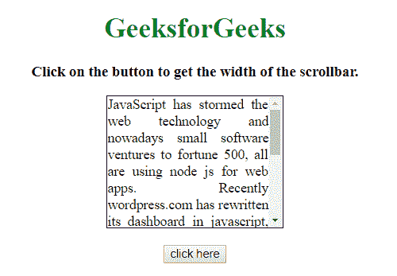
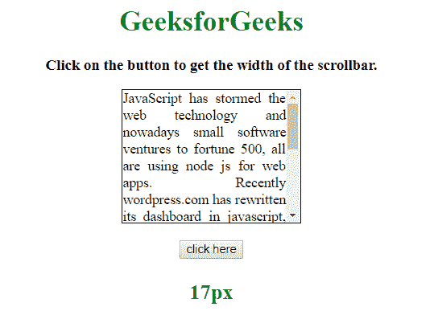

# 如何用 JavaScript 获取滚动条的宽度？

> 原文:[https://www . geesforgeks . org/如何使用 javascript 获取滚动条宽度/](https://www.geeksforgeeks.org/how-to-get-the-width-of-scroll-bar-using-javascript/)

给定一个 HTML 文档，任务是使用 JavaScript 获取滚动条的宽度。解决这个问题有两种不同方法，下面讨论:

**方法 1:**

*   创建一个包含滚动条的元素(div)。
*   OffsetWidth 定义元素的宽度+滚动条的宽度。
*   ClientWidth 定义元素的宽度。
*   因此滚动条可以定义为 width = offsetWidth–client width。

**示例 1:** 该示例实现了上述方法。

```
<!DOCTYPE HTML> 
<html> 

<head> 
    <title> 
        How to get the width of scroll
        bar using JavaScript ?
    </title>

    <style>
        body {
            text-align:center;
        }
        h1 {
            color:green;
        }
        #div {
            width:200px; 
            height:150px; 
            overflow:auto;
            margin:auto;
            text-align:justify;
            border:1px solid black;
        }
        #GFG_UP {
            font-size: 17px; 
            font-weight: bold;
        }
        #GFG_DOWN {
            font-size: 24px; 
            font-weight: bold;
            color: green;
        }
    </style>
</head> 

<body> 

    <h1>GeeksforGeeks</h1>

    <p id = "GFG_UP"></p>

    <div id="div">
        JavaScript has stormed the web technology and
        nowadays small software ventures to fortune
        500, all are using node js for web apps. 
        Recently wordpress.com has rewritten its
        dashboard in javascript, paypal also chose to
        rewrite some of its components in java script.
        Be it google/twitter/facebook, javascript is
        important for everyone. It is used in 
        applications like single page applications,
        Geolocation APIs, net advertisements etc.
    </div>

    <br>

    <button onclick = "GFG_FUN()">
        click here
    </button>

    <p id = "GFG_DOWN"></p>

    <script>
        var element = document.getElementById('div');
        var el_up = document.getElementById('GFG_UP');
        var el_down = document.getElementById('GFG_DOWN');

        el_up.innerHTML = "Click on the button to get "
                    + "the width of the scrollbar.";

        function GFG_FUN() {
            el_down.innerHTML = element.offsetWidth 
                        - element.clientWidth + "px";
        }
    </script> 
</body> 

</html>
```

**输出:**

*   **点击按钮前:**
    
*   **点击按钮后:**
    

**方法 2:**

*   创建外部 div 元素。
*   在外部 div 中创建一个 div，称之为内部 div。
*   用外部 div 减去内部 div 的宽度，得到滚动条的宽度。

**示例 2:** 该示例实现了上述方法。

```
<!DOCTYPE HTML> 
<html> 

<head> 
    <title> 
        How to get the width of scroll
        bar using JavaScript ?
    </title>

    <style>
        body {
            text-align:center;
        }
        h1 {
            color:green;
        }
        .outer {
            width:200px; 
            height:150px; 
            overflow-y:auto;
            margin:auto;
            text-align:justify;
            border:1px solid black;
        }
        #GFG_UP {
            font-size: 17px; 
            font-weight: bold;
        }
        #GFG_DOWN {
            font-size: 24px; 
            font-weight: bold;
            color: green;
        }
    </style>
</head> 

<body> 
    <h1>GeeksforGeeks</h1>

    <p id = "GFG_UP"></p>

    <div class="outer">
        <div class="inner">
            JavaScript has stormed the web technology and
            nowadays small software ventures to fortune
            500, all are using node js for web apps. 
            Recently wordpress.com has rewritten its
            dashboard in javascript, paypal also chose to
            rewrite some of its components in java script.
            Be it google/twitter/facebook, javascript is
            important for everyone. It is used in 
            applications like single page applications,
            Geolocation APIs, net advertisements etc.
        </div>
    </div>

    <br>

    <button onclick = "GFG_FUN()">
        click here
    </button>

    <p id = "GFG_DOWN"></p>

    <script>
        var element = document.getElementById('div');
        var el_up = document.getElementById('GFG_UP');
        var el_down = document.getElementById('GFG_DOWN');

        el_up.innerHTML = "Click on the button to get "
                    + "the width of the scrollbar.";

        function GFG_FUN() {
            var child = document.querySelector(".inner");
            var scroll = child.parentNode.offsetWidth - child.offsetWidth;
            el_down.innerHTML = scroll + "px";
        }
    </script> 
</body> 

</html>
```

**输出:**

*   **点击按钮前:**
    
*   **点击按钮后:**
    