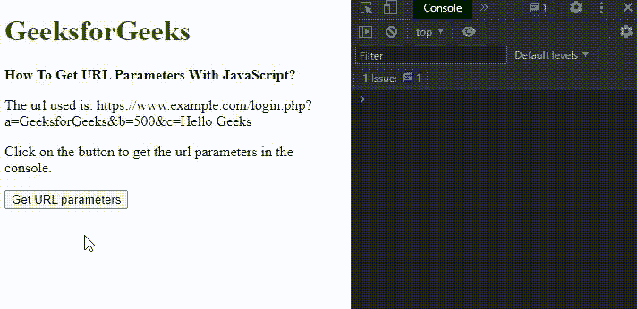
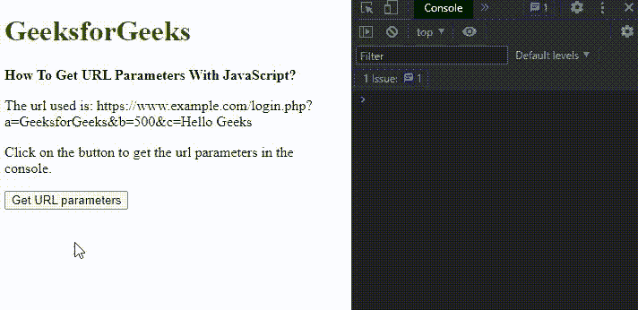

# 如何用 JavaScript 获取 URL 参数？

> 原文:[https://www . geesforgeks . org/如何获取 URL-参数-使用-javascript/](https://www.geeksforgeeks.org/how-to-get-url-parameters-using-javascript/)

在本文中，我们将学习如何在 Javascript 中获取 URL 参数，并通过示例了解它们的实现。

获取网址参数有两种方法:

*   通过使用[URL 搜索参数对象](https://www.geeksforgeeks.org/node-js-urlsearchparams-entries/)
*   通过使用分离和访问每个参数对

**方法 1:使用 URL 搜索参数对象**

网址搜索参数是一个接口，用于提供可用于处理网址的方法。网址字符串首先被分开，只得到网址的参数部分。split()方法用于带有“？”的给定 URL 分离器。它会把绳子分成两部分。仅使用参数选择第二部分。然后，它被传递给 URLSearchParams 构造函数。

这个对象的 **entries()** 方法返回一个带有键/值对的迭代器。然后可以通过访问该对的第一个索引来检索该对的键部分，并且可以通过访问第二个索引来检索该值。这可以用来获取网址中的所有参数，这些参数可以根据需要使用。

**语法:**

```
let paramString = urlString.split('?')[1];
let queryString = new URLSearchParams(paramString);

for (let pair of queryString.entries()) {
   console.log("Key is: " + pair[0]);
   console.log("Value is: " + pair[1]);
}
```

**示例:**此示例说明了如何使用 URLSearchParams 对象来获取 URL 参数。

## 超文本标记语言

```
<!DOCTYPE html>
<html>

<head>
    <title>How To Get URL Parameters using JavaScript?</title>
</head>

<body>
    <h1 style="color:green;">
        GeeksforGeeks
    </h1> 
    <b>
        How To Get URL Parameters
        With JavaScript?
    </b>
    <p> The url used is: 
https://www.example.com/login.php? a=GeeksforGeeks&b=500&c=Hello Geeks 
    </p>

    <p> Click on the button to get the url parameters in the console. </p>

    <button onclick="getParameters()"> Get URL parameters </button>
    <script>
    function getParameters() {
        let urlString = 
"https://www.example.com/login.php?a=GeeksforGeeks&b=500&c=Hello Geeks";
        let paramString = urlString.split('?')[1];
        let queryString = new URLSearchParams(paramString);
        for(let pair of queryString.entries()) {
            console.log("Key is:" + pair[0]);
            console.log("Value is:" + pair[1]);
        }
    }
    </script>
</body>

</html>
```

**输出:**



条目()方法

**方法 2:分离和访问每个参数对**

首先分离查询字符串，只获取字符串的参数部分。split()方法用于带有“？”的给定 URL 分离器。这将把网址分成两部分，第二部分只选择参数。再次使用 split()方法将该字符串分隔成参数，并以“&”作为分隔符。这将把每个参数字符串分成一个数组。

该数组循环遍历每个键，并且通过使用“=”作为分隔符进行拆分来分隔值。它会将这些对分成一个数组。可以通过访问对的第一个索引来检索对的键部分，并且可以通过访问第二个索引来检索值。这可以用来获取网址中的所有参数，这些参数可以根据需要使用。

**语法:**

```
let paramString = urlString.split('?')[1];
let params_arr = paramString.split('&');

for (let i = 0; i < params_arr.length; i++) {
   let pair = params_arr[i].split('=');
   console.log("Key is:", pair[0]);
   console.log("Value is:", pair[1]);
}
```

**示例:**此示例说明了每个参数对的单独访问。

## 超文本标记语言

```
<!DOCTYPE html>
<html>

<head>
    <title> How To Get URL Parameters using JavaScript? </title>
</head>

<body>
    <h1 style="color:green;">
        GeeksforGeeks
    </h1> <b>
        How To Get URL Parameters
        With JavaScript?
    </b>
    <p> The url used is: 
https://www.example.com/login.php? a=GeeksforGeeks&b=500&c=Hello Geeks 
    </p>

    <p> Click on the button to get the url parameters in the console. </p>

    <button onclick="getParameters()"> Get URL parameters </button>
    <script>
    function getParameters() {
        let urlString = 
"https://www.example.com/login.php?a=GeeksforGeeks&b=500&c=Hello Geeks";
        let paramString = urlString.split('?')[1];
        let params_arr = paramString.split('&');
        for(let i = 0; i < params_arr.length; i++) {
            let pair = params_arr[i].split('=');
            console.log("Key is:" + pair[0]);
            console.log("Value is:" + pair[1]);
        }
    }
    </script>
</body>

</html>
```

**输出:**

