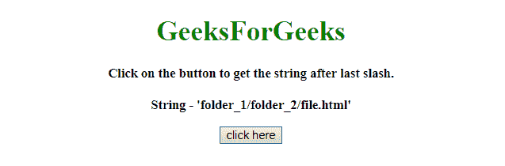
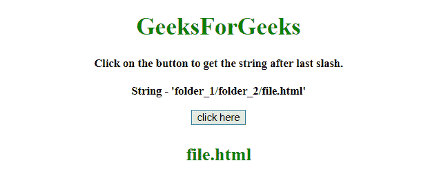

# 如何获取 JavaScript 中最后一个斜杠后的字符串的值？

> 原文:[https://www . geesforgeks . org/如何获取 javascript 中最后一个斜杠后的字符串值/](https://www.geeksforgeeks.org/how-to-get-value-of-a-string-after-last-slash-in-javascript/)

任务是获取特定字符(“/”)后面的字符串。这里讨论了一些最常用的技术。我们将使用 JavaScript。
**进场 1:**

*   将绳子分开**。split()方法**并将其放入变量(数组)中。
*   使用**。长度属性**获取数组的长度。
*   从数组中返回位于*索引=长度-1* 的元素。

**示例 1:** 该示例使用上述方法。

```
<!DOCTYPE HTML>
<html>

<head>
    <title>
        Get value of a string
      after last slash in JavaScript?
    </title>
</head>

<body style="text-align:center;"
      id="body">
    <h1 style="color:green;">  
            GeeksForGeeks  
        </h1>
    <p id="GFG_UP" 
       style="font-size: 15px;
              font-weight: bold;">
    </p>
    <button onclick="GFG_FUN()">
        click here
    </button>
    <p id="GFG_DOWN" 
       style="font-size: 24px; 
              font-weight: bold;
              color: green;">
    </p>
    <script>
        var el_up = document.getElementById("GFG_UP");
        var el_down = document.getElementById("GFG_DOWN");
        var str = "folder_1/folder_2/file.html";
        el_up.innerHTML = "Click on the button to get"+
          " the string after last slash.<br><br>String - '"
        + str + "'";

        function GFG_FUN() {
            str = str.split("/");
            el_down.innerHTML = str[str.length - 1];
        }
    </script>
</body>

</html>
```

**输出:**

*   **点击按钮前:**
    
*   **点击按钮后:**
    

**方法 2:**

*   首先，使用**找到 **('/')** 的最后一个索引。lastIndexOf(str)方法**。
*   使用**。substring()** 方法获取访问最后一个斜杠后的字符串。

**示例 2:** 该示例使用上述方法。

```
<!DOCTYPE HTML>
<html>

<head>
    <title>
        Get value of a string 
      after last slash in JavaScript?
    </title>
</head>

<body style="text-align:center;" 
      id="body">
    <h1 style="color:green;">  
            GeeksForGeeks  
        </h1>
    <p id="GFG_UP"
       style="font-size: 15px;
              font-weight: bold;">
    </p>
    <button onclick="GFG_FUN()">
        click here
    </button>
    <p id="GFG_DOWN" 
       style="font-size: 24px; 
              font-weight: bold;
              color: green;">
    </p>
    <script>
        var el_up = document.getElementById("GFG_UP");
        var el_down = document.getElementById("GFG_DOWN");
        var str = "folder_1/folder_2/file.html";
        el_up.innerHTML = "Click on the button to get"+
          " the string after last slash.<br><br>String - '"
        + str + "'";

        function GFG_FUN() {
            el_down.innerHTML = 
              str.substring(str.lastIndexOf('/') + 1);
        }
    </script>
</body>

</html>
```

**输出:**

*   **点击按钮前:**
    
*   **点击按钮后:**
    