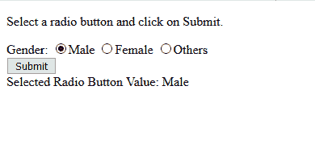
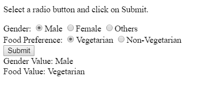

# 如何用 JavaScript 获取选中单选按钮的值？

> 原文:[https://www . geesforgeks . org/如何使用 javascript 获取所选单选按钮的价值/](https://www.geeksforgeeks.org/how-to-get-value-of-selected-radio-button-using-javascript/)

要获取所选单选按钮的值，可以创建一个用户定义的函数，该函数获取所有具有名称属性的单选按钮，并使用**选中的**属性找到所选的单选按钮。如果选择了单选按钮，则选中的属性返回“真”，否则返回“假”。如果网页中有多个单选按钮，首先会提取所有输入标签，然后显示所有类型为“单选”并被选中的标签的值。

**示例 1:** 当用户点击提交按钮时，以下程序显示所选单选按钮的值。

```
<!DOCTYPE html>
<html>

<head>
    <title>
        Get value of selected
        radio button
    </title>
</head>

<body>
    <p>
        Select a radio button and click on Submit.
    </p>

    Gender:
    <input type="radio" name="gender" value="Male">Male
    <input type="radio" name="gender" value="Female">Female
    <input type="radio" name="gender" value="Others">Others

    <br>

    <button type="button" onclick="displayRadioValue()">
        Submit
    </button>

    <br>

    <div id="result"></div>

    <script>
        function displayRadioValue() {
            var ele = document.getElementsByName('gender');

            for(i = 0; i < ele.length; i++) {
                if(ele[i].checked)
                document.getElementById("result").innerHTML
                        = "Gender: "+ele[i].value;
            }
        }
    </script>
</body>
</html>                    
```

**输出:**


**示例 2:** 单击提交时，以下程序显示所有选定单选按钮的值。

```
<!DOCTYPE html>
<html>

<head>
    <title>
        Get value of selected radio button
    </title>
</head>

<body>
    <p>
        Select a radio button and click on Submit.
    </p>

    Gender:
    <input type="radio" name="Gender" value="Male">Male
    <input type="radio" name="Gender" value="Female">Female
    <input type="radio" name="Gender" value="Others">Others

    <br>

    Food Preference:
    <input type="radio" name="Food" value="Vegetarian">Vegetarian
    <input type="radio" name="Food" value="Non-Vegetarian">Non-Vegetarian

    <br>

    <button type="button" onclick="displayRadioValue()">
        Submit
    </button>

    <br>

    <div id="result"></div>

    <script>
        function displayRadioValue() {
            document.getElementById("result").innerHTML = "";
            var ele = document.getElementsByTagName('input');

            for(i = 0; i < ele.length; i++) {

                if(ele[i].type="radio") {

                    if(ele[i].checked)
                        document.getElementById("result").innerHTML
                                += ele[i].name + " Value: "
                                + ele[i].value + "<br>";
                }
            }
        }
    </script>
</body>

</html>                    
```

**输出:**


JavaScript 最出名的是网页开发，但它也用于各种非浏览器环境。您可以通过以下 [JavaScript 教程](https://www.geeksforgeeks.org/javascript-tutorial/)和 [JavaScript 示例](https://www.geeksforgeeks.org/javascript-examples/)从头开始学习 JavaScript。