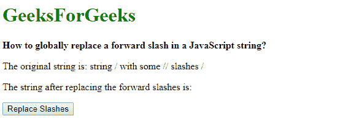
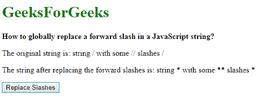

# 如何全局替换 JavaScript 字符串中的正斜杠？

> 原文:[https://www . geesforgeks . org/如何全局替换 javascript 字符串中的正斜杠/](https://www.geeksforgeeks.org/how-to-globally-replace-a-forward-slash-in-a-javascript-string/)

**方法 1:用正则表达式使用 replace()方法:**使用 **replace()方法**用另一个字符串替换给定的模式。模式字符串可以是字符串或正则表达式。这个函数将返回一个新的字符串和被替换的字符串。

正则表达式用于替换所有的正斜杠。正斜杠(/)是正则表达式中的特殊字符，因此必须用反斜杠(\)进行转义。此外，为了替换字符串上的所有正斜杠，使用了全局修饰符(g)。它将替换给定字符串中的所有正斜杠。

**语法:**

```
originalString.replace(/\//g, replacementString)
```

**示例:**

```
<!DOCTYPE html>
<html>
<head>
    <title>
        How to globally replace a forward
        slash in a JavaScript string?
    </title>
</head>

<body>
    <h1 style="color: green">
        GeeksForGeeks
    </h1>

    <b>
        How to globally replace a forward slash
        in a JavaScript string?
    </b>

    <p>
        The original string is: 
        string / with some // slashes /
    </p>

    <p>
        The string after replacing the
        forward slashes is:
        <span class="output"></span>
    </p>

    <button onclick="replaceSlashes()">
        Replace Slashes
    </button>

    <script type="text/javascript">
        function replaceSlashes() {

            let origString = 'string / with some // slashes /';
            let replacementString = '*';
            let replacedString = 
                origString.replace(/\//g, replacementString);

            document.querySelector('.output').textContent = 
                        replacedString;
        }
    </script>
</body>

</html>
```

**输出:**

*   **点击按钮前:**
    
*   **点击按钮后:**
    

**方法二:拆分代替正斜杠，用需要的字符串连接回来:****split()方法**用于根据分隔符将字符串分隔成字符串数组。字符串首先以正斜杠作为分隔符进行分隔。它将给出一个字符串数组，在正斜杠出现的位置进行分隔。
使用 **join()** 方法用指定的分隔符连接字符串数组。这里将使用所需的字符而不是前向字符作为参数传递。这将替换给定字符串中的所有正斜杠。

**语法:**

```
origString.split('/').join(replacementString)
```

**示例:**

```
<!DOCTYPE html>
<html>

<head>
    <title>
        How to globally replace a forward
        slash in a JavaScript string?
    </title>
</head>

<body>
    <h1 style="color: green">
        GeeksForGeeks
    </h1>

    <b>
        How to globally replace a forward
        slash in a JavaScript string?
    </b>

    <p>
        The original string is: 
        string / with some // slashes /
    </p>

    <p>
        The string after replacing the
        forward slashes is:
        <span class="output"></span>
    </p>

    <button onclick="replaceSlashes()">
        Replace Slashes
    </button>

    <script type="text/javascript">
        function replaceSlashes() {

            let origString = 'string / with some // slashes /';
            let replacementString = '*';
            let replacedString = 
                 origString.split('/').join(replacementString);

            document.querySelector('.output').textContent = 
                        replacedString;
        }
    </script>
</body>

</html>
```

**输出:**

*   **点击按钮前:**
    
*   **点击按钮后:**
    