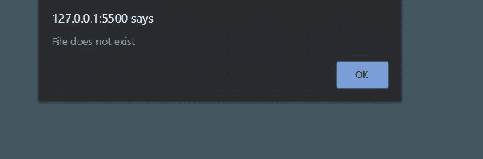
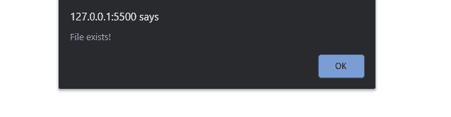

# 如果锚点 href 属性为空，如何使用 JavaScript 隐藏 span 元素？

> 原文:[https://www . geesforgeks . org/how-hide-span-element-if-anchor-href-attribute-is-empty-using-JavaScript/](https://www.geeksforgeeks.org/how-to-hide-span-element-if-anchor-href-attribute-is-empty-using-javascript/)

当 **<的 href 属性为>** 标记不存在或无效时，任务是隐藏 **< span >** 标记。

让我们考虑一下我们有 **<一个>** 标签里面的**T6】span>**标签。它看起来类似于这样:

```html
<span><a href="www.google.com"></a></span>
```

现在，我们将 id 添加到元素中以识别它们。

```html
<span id="outer"><a id="inner" href="www.google.com"></a></span>

```

现在，当 **<的“href”属性为空或无效时，我们必须隐藏 **< span >** 标记。**

**进场:**

*   第一种情况是 href 为空。所以我们只需要检查空的 href，这可以使用普通的 JavaScript 来完成。
*   在第二种情况下，href 指向一个文件/位置。我们需要检查它是否是一个有效的文件/位置。现在在这种情况下，当 **href** 出现时，我们检查它是否指向某个有效的文件或位置。我们将使用 jQuery Ajax 调用来实现。jQuery Ajax 调用可以用来在幕后与 web 服务器交换数据。如果它返回一个错误，那么文件的位置是无效的。

**示例 1:** 下面的代码显示了 href 为空时的情况。

## 超文本标记语言

```html
<!DOCTYPE html>
<html>

<body>
    <span id="outer">
        <a id="inner" href="">this is link</a>
    </span>

    <script>
        if(document.getElementById("inner")
                    .getAttribute("href")=="") {
            document.getElementById("outer")
                      .style.display = "none";
            alert("File does not exist");
        }
    </script>
</body>

</html>
```

**输出:**



**示例 2:** 下面的代码是 href 指向某个位置时的示例。

## 超文本标记语言

```html
<!DOCTYPE html>
<html>

<head>
    <script src=
"https://cdnjs.cloudflare.com/ajax/libs/jquery/3.5.1/jquery.min.js" >
    </script>
</head>

<body>
    <span id="outer">
        <a id="inner" href=
"https://jsonplaceholder.typicode.com/todos/1">
            this is link
        </a>
    </span>

    <script>
        // Function to check if url is
        // valid by making Ajax call
        function doesFileExist(url) {
            $.ajax({
                headers:{    
                    'Accept': 'application/json',
                    'Content-Type': 'application/json',
                    'Access-Control-Allow-Origin': '*' 
                },
                method:'HEAD',
                url:url,
                success:function(){
                    alert("File exists!")
                },
                error:function(){
                    // Hiding the outer span tag
                    $("#outer").hide() 
                    alert("File does not exists!")
                },
            })
        }

        // Storing the location href is pointing to
        url=$("#inner").attr("href") 
        doesFileExist(url)
    </script>
</body>

</html>
```

**输出:**

