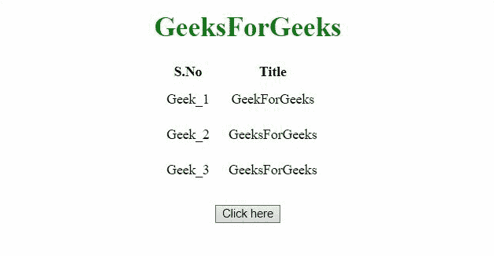

# 如何用 JavaScript 隐藏表头？

> 原文:[https://www . geeksforgeeks . org/如何使用 javascript 隐藏表格标题/](https://www.geeksforgeeks.org/how-to-hide-the-table-header-using-javascript/)

有两种方法可以在 JavaScript 的帮助下帮助隐藏表格标题。下文将讨论这些问题:

**方法 1:** 使用 CSS 选择器选择标题并修改**样式**属性，使得**显示**属性的值设置为**无**。这将在页面中隐藏选定的表格标题元素。

**示例:**

## 超文本标记语言

```html
<!DOCTYPE HTML>
<html>
<head>
    <title>
      How to hide the table
      header using JavaScript
    </title>
    <style>
        table {
            margin-left: 180px;
        }

        td {
            padding: 10px;
        }
    </style>
</head>

<body style="text-align:center;">
    <h1 style="color:green;">
        GeeksForGeeks
    </h1>
    <table id="table">
        <colgroup>
            <col id="myCol"
                 span="2">
            <col>
        </colgroup>
        <tr id="thead">
            <th>S.No</th>
            <th>Title</th>
        </tr>
        <tr>
            <td>Geek_1</td>
            <td>GeekForGeeks</td>
        </tr>
        <tr>
            <td>Geek_2</td>
            <td>GeeksForGeeks</td>
        </tr>
        <tr>
            <td>Geek_3</td>
            <td>GeeksForGeeks</td>
        </tr>
    </table>
    <br>
    <button onclick="Geeks()">
        Click here
    </button>
    <p id="GFG_DOWN">
    </p>

    <script>
        var el_down =
            document.getElementById("GFG_DOWN");
        function Geeks() {
            var tb
            = document.getElementById("thead");
            tb.style.display = "none";
            el_down.innerHTML = 
              "Table header is hidden";
        } 
    </script>
</body>

</html>
```

**输出:**



**方法二:**使用 jQuery 选择要隐藏的表头，并对其使用 **hide()** 方法。这个 jQuery 方法有助于隐藏使用它的元素。

**示例:**

## 超文本标记语言

```html
<!DOCTYPE HTML>
<html>
<head>
    <title>
      How to hide the table 
      header using JavaScript
    </title>
    <script src =
"https://ajax.googleapis.com/ajax/libs/jquery/3.4.0/jquery.min.js">
    </script>
    <style>
        table {
            margin-left: 180px;
        }

        td {
            padding: 10px;
        }
    </style>
</head>
<body style="text-align:center;">
    <h1 style="color:green;">
        GeeksForGeeks
    </h1>
    <table id="table">
        <colgroup>
            <col id="myCol" 
                 span="2">
            <col>
        </colgroup>
        <tr id="thead">
            <th>S.No</th>
            <th>Title</th>
        </tr>
        <tr>
            <td>Geek_1</td>
            <td>GeekForGeeks</td>
        </tr>
        <tr>
            <td>Geek_2</td>
            <td>GeeksForGeeks</td>
        </tr>
        <tr>
            <td>Geek_3</td>
            <td>GeeksForGeeks</td>
        </tr>
    </table>
    <br>
    <button onclick="Geeks()">
        Click here
    </button>
    <p id="GFG_DOWN">
    </p>

    <script>
        var el_down = 
            document.getElementById("GFG_DOWN");
        function Geeks() {
            $("#thead").hide();
            el_down.innerHTML =
              "Table header is hidden";
        } 
    </script>
</body>
</html>
```

**输出:**

